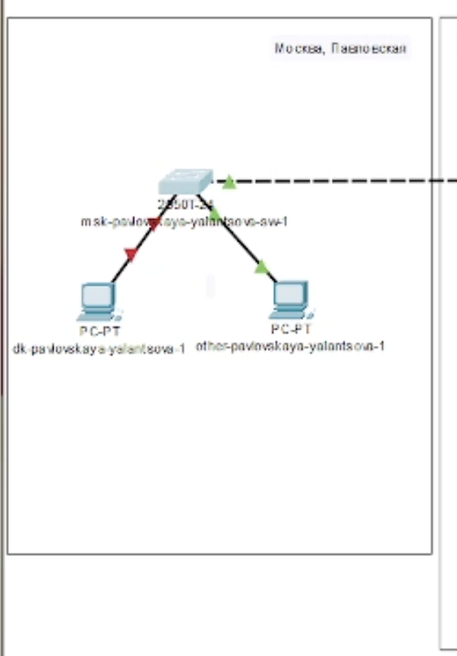
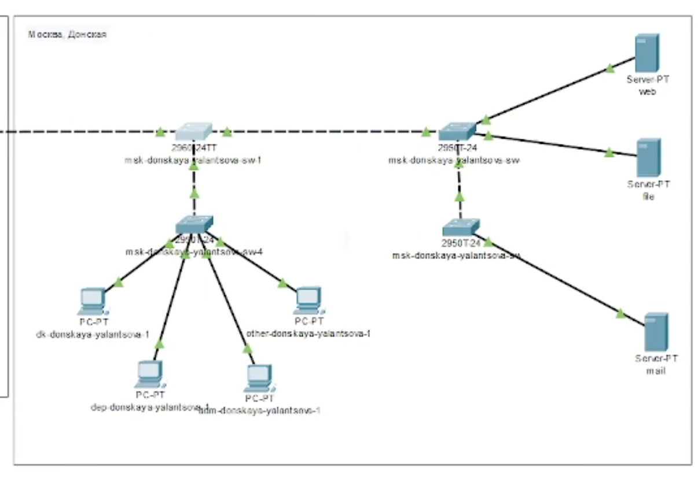
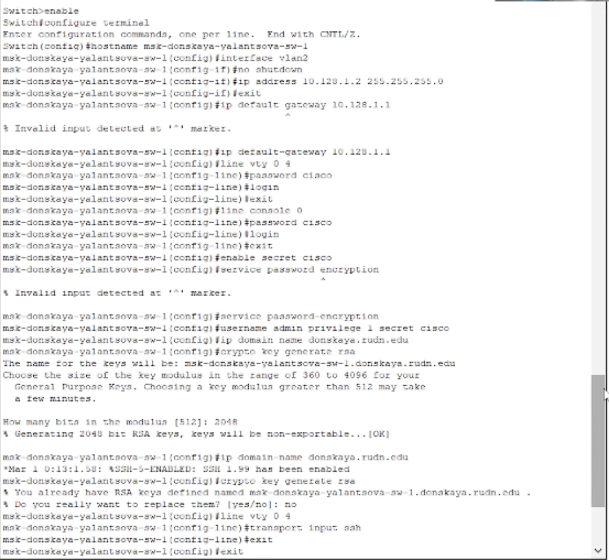
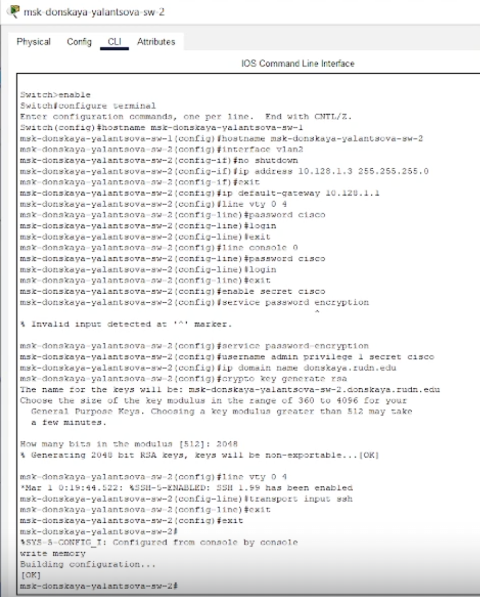
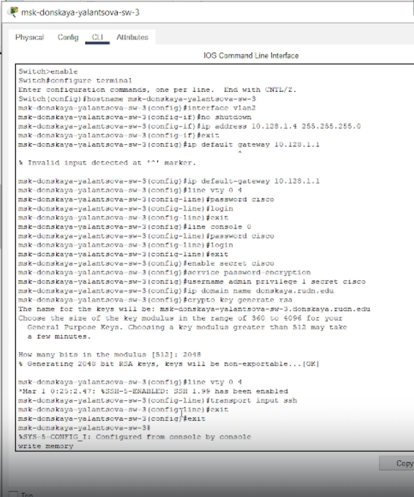
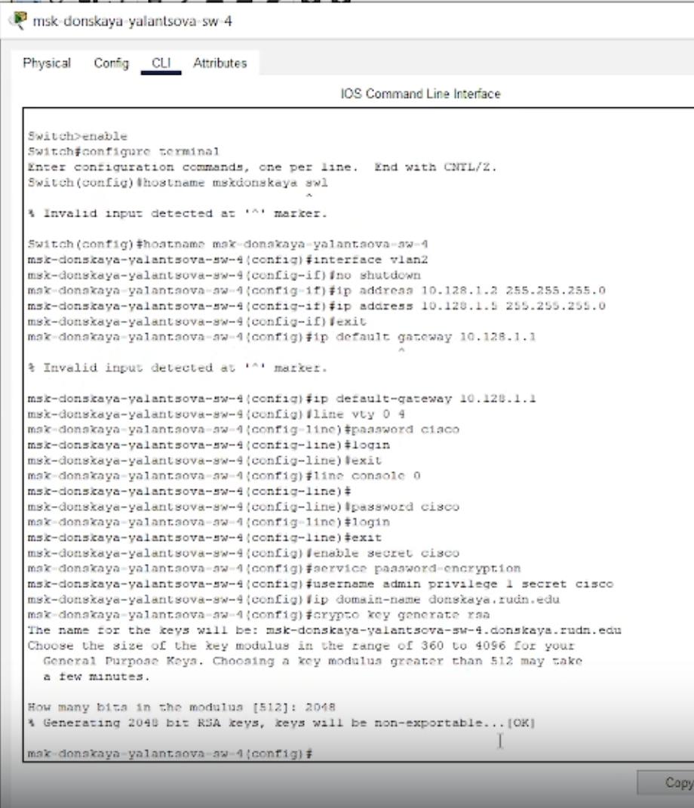
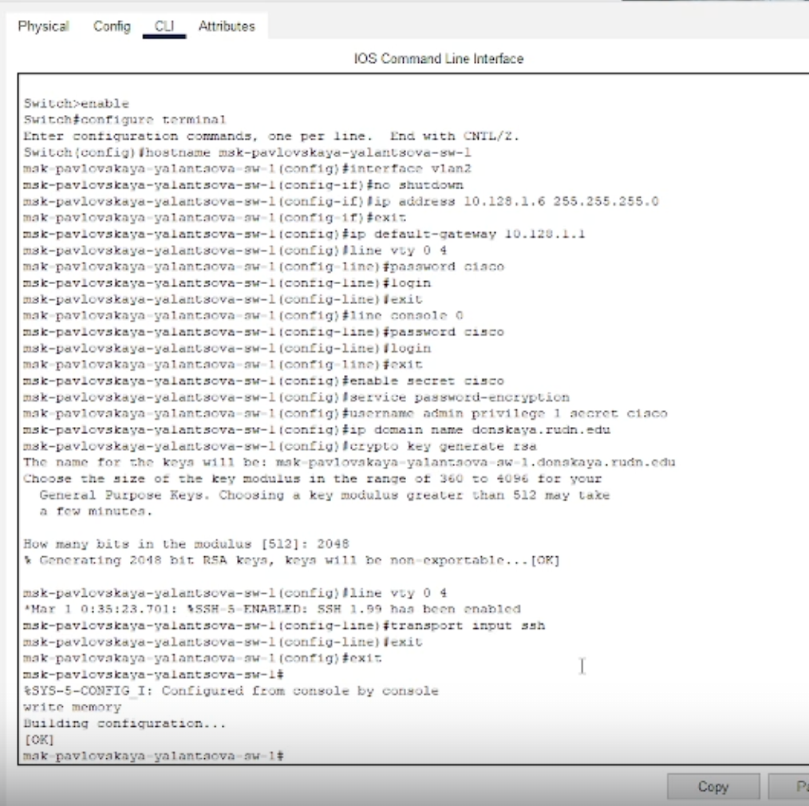

---
## Front matter
title: "Лабораторная работа 4"
subtitle: "Первоначальное конфигурирование сети"
author: "Ланцова Яна Игоревна"

## Generic otions
lang: ru-RU
toc-title: "Содержание"

## Bibliography
bibliography: bib/cite.bib
csl: pandoc/csl/gost-r-7-0-5-2008-numeric.csl

## Pdf output format
toc: true # Table of contents
toc-depth: 2
lof: true # List of figures
lot: true # List of tables
fontsize: 12pt
linestretch: 1.5
papersize: a4
documentclass: scrreprt
## I18n polyglossia
polyglossia-lang:
  name: russian
  options:
    - spelling=modern
    - babelshorthands=true
polyglossia-otherlangs:
  name: english
## I18n babel
babel-lang: russian
babel-otherlangs: english
## Fonts
mainfont: IBM Plex Serif
romanfont: IBM Plex Serif
sansfont: IBM Plex Sans
monofont: IBM Plex Mono
mathfont: STIX Two Math
mainfontoptions: Ligatures=Common,Ligatures=TeX,Scale=0.94
romanfontoptions: Ligatures=Common,Ligatures=TeX,Scale=0.94
sansfontoptions: Ligatures=Common,Ligatures=TeX,Scale=MatchLowercase,Scale=0.94
monofontoptions: Scale=MatchLowercase,Scale=0.94,FakeStretch=0.9
mathfontoptions:
## Biblatex
biblatex: true
biblio-style: "gost-numeric"
biblatexoptions:
  - parentracker=true
  - backend=biber
  - hyperref=auto
  - language=auto
  - autolang=other*
  - citestyle=gost-numeric
## Pandoc-crossref LaTeX customization
figureTitle: "Рис."
tableTitle: "Таблица"
listingTitle: "Листинг"
lofTitle: "Список иллюстраций"
lotTitle: "Список таблиц"
lolTitle: "Листинги"
## Misc options
indent: true
header-includes:
  - \usepackage{indentfirst}
  - \usepackage{float} # keep figures where there are in the text
  - \floatplacement{figure}{H} # keep figures where there are in the text
---

# Цель работы

Провести подготовительную работу по первоначальной настройке коммутаторов сети.

# Задание

- Требуется сделать первоначальную настройку коммутаторов сети, представленной на схеме L1. Под первоначальной настройкой понимается указание имени устройства, его IP-адреса, настройка доступа по паролю к виртуальным терминалам и консоли, настройка удалённого доступа к устройству по ssh. 
- При выполнении работы необходимо учитывать соглашение об именовании.

# Выполнение лабораторной работы

В логической рабочей области Packet Tracer разместим коммутаторы и оконечные устройства согласно схеме сети L1  и соединим их через соответствующие интерфейсы. Для соединения коммутаторов между собой используем кроссовый кабель, а для подключения коммутаторов к оконечным устройством возьмем прямой кабель. (рис. [-@fig:001] - [-@fig:002]).

{#fig:001 width=70%}

{#fig:002 width=70%}

Используя типовую конфигурацию коммутатора, настроем все коммутаторы, изменяя название устройства и его IP-адрес согласно плану IP, сделанный в предыдущей лабораторной работе.

Для первого устройства имя msk-donskaya-yalantsova-sw-1 зададим ip-адрес -- 10.128.1.2 (рис. [-@fig:003]):

{#fig:003 width=70%}

Для второго устройства имя msk-donskaya-yalantsova-sw-2 зададим ip-адрес -- 10.128.1.3.

{#fig:004 width=70%}

Для третьего устройства имя msk-donskaya-yalantsova-sw-3 зададим ip-адрес -- 10.128.1.4.

{#fig:005 width=70%}

Для четвертого устройства имя msk-donskaya-yalantsova-sw-4 зададим ip-адрес -- 10.128.1.5.

{#fig:006 width=70%}

{#fig:007 width=70%}

Для пятого устройства имя msk-pavlovskaya-yalantsova-sw-1 зададим ip-адрес -- 10.128.1.6.

{#fig:008 width=70%}


# Выводы

В результате выполнения данной лабораторной работы я провела подготовительную работу по первоначальной настройке коммутаторов сети.

# Контрольные вопросы

1. При помощи каких команд можно посмотреть конфигурацию сетевого
оборудования?

При помощи команд:

```
sh ru
show running-config
```

2. При помощи каких команд можно посмотреть стартовый конфигурационный файл оборудования?

При помощи команд:

```
sh sta
show run
```

3. При помощи каких команд можно экспортировать конфигурационный файл
оборудования?

Можно нажать кнопку `Export`  в окне для конфигурации устройства.

4. При помощи каких команд можно импортировать конфигурационный файл
оборудования?

Можно нажать кнопку `Import`  в окне для конфигурации устройства.
