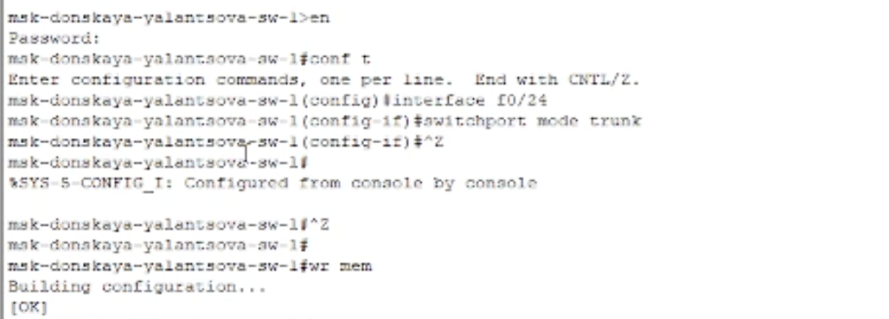
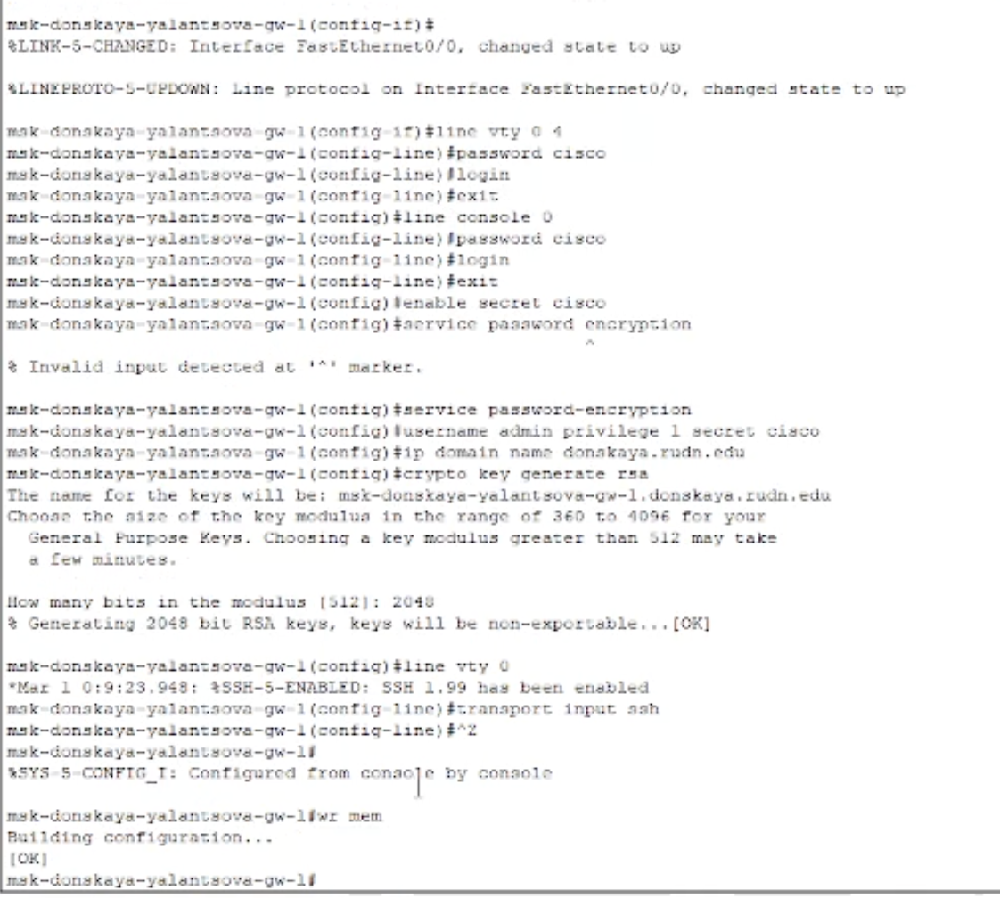
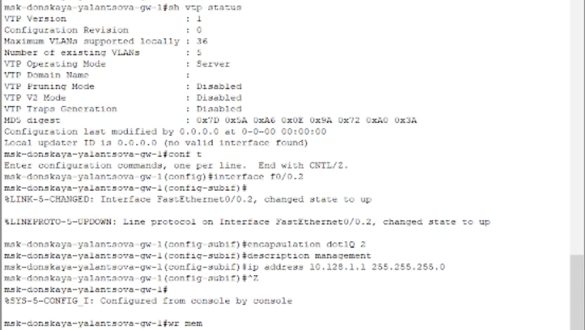
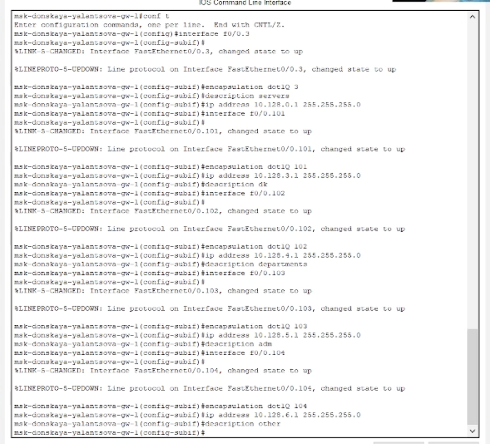
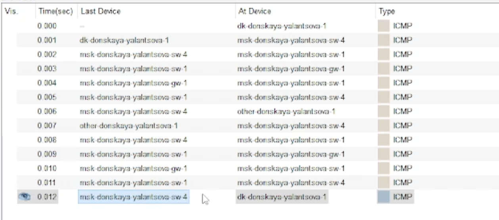
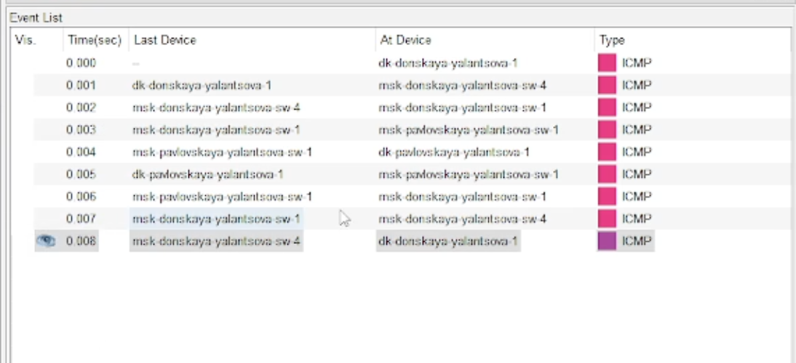
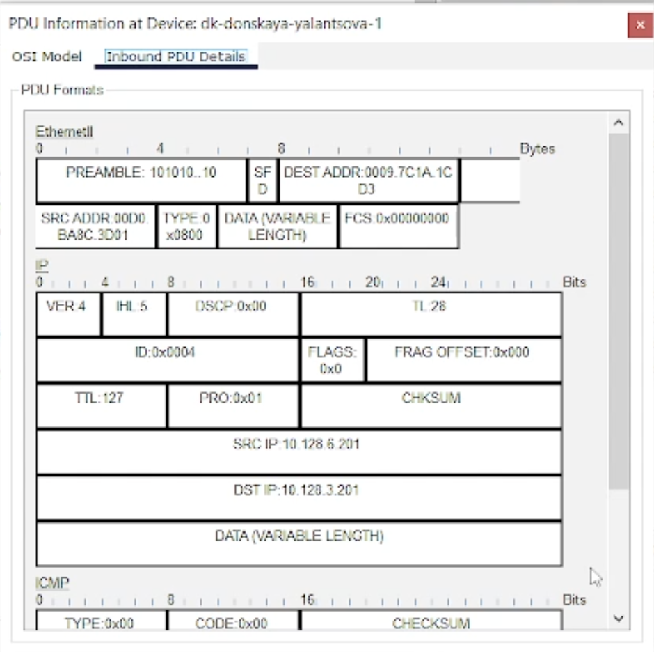

---
## Front matter
title: "Лабораторная работа 6"
subtitle: "Статическая маршрутизация VLAN"
author: "Ланцова Яна Игоревна"

## Generic otions
lang: ru-RU
toc-title: "Содержание"

## Bibliography
bibliography: bib/cite.bib
csl: pandoc/csl/gost-r-7-0-5-2008-numeric.csl

## Pdf output format
toc: true # Table of contents
toc-depth: 2
lof: true # List of figures
lot: true # List of tables
fontsize: 12pt
linestretch: 1.5
papersize: a4
documentclass: scrreprt
## I18n polyglossia
polyglossia-lang:
  name: russian
  options:
    - spelling=modern
    - babelshorthands=true
polyglossia-otherlangs:
  name: english
## I18n babel
babel-lang: russian
babel-otherlangs: english
## Fonts
mainfont: IBM Plex Serif
romanfont: IBM Plex Serif
sansfont: IBM Plex Sans
monofont: IBM Plex Mono
mathfont: STIX Two Math
mainfontoptions: Ligatures=Common,Ligatures=TeX,Scale=0.94
romanfontoptions: Ligatures=Common,Ligatures=TeX,Scale=0.94
sansfontoptions: Ligatures=Common,Ligatures=TeX,Scale=MatchLowercase,Scale=0.94
monofontoptions: Scale=MatchLowercase,Scale=0.94,FakeStretch=0.9
mathfontoptions:
## Biblatex
biblatex: true
biblio-style: "gost-numeric"
biblatexoptions:
  - parentracker=true
  - backend=biber
  - hyperref=auto
  - language=auto
  - autolang=other*
  - citestyle=gost-numeric
## Pandoc-crossref LaTeX customization
figureTitle: "Рис."
tableTitle: "Таблица"
listingTitle: "Листинг"
lofTitle: "Список иллюстраций"
lotTitle: "Список таблиц"
lolTitle: "Листинги"
## Misc options
indent: true
header-includes:
  - \usepackage{indentfirst}
  - \usepackage{float} # keep figures where there are in the text
  - \floatplacement{figure}{H} # keep figures where there are in the text
---

# Цель работы

Настроить статическую маршрутизацию VLAN в сети.

# Задание

1. Добавить в локальную сеть маршрутизатор, провести его первоначальную настройку.
2. Настроить статическую маршрутизацию VLAN.
3. При выполнении работы необходимо учитывать соглашение об именовании.

# Выполнение лабораторной работы

В логической области проекта разместить маршрутизатор Cisco 2811, подключим его к порту 24 коммутатора msk-donskaya-sw-1 в соответствии с таблицей портов, у маршрутизатора подключение через порт 0.

Настроим порт 24 коммутатора msk-donskaya-yalantsova-sw-1 как trunk-порт(рис. [-@fig:001]).

{#fig:001 width=70%}

Сконфигурируем маршрутизатор, задав на нём имя msk-donskaya-yalantsova-gw-1, пароль для доступа к консоли и удалённое подключение по ssh(рис. [-@fig:002]).

{#fig:002 width=70%}

На интерфейсе f0/0 маршрутизатора msk-donskaya-yalantsova-gw-1 настроим виртуальные интерфейсы, соответствующие номерам VLAN. Согласно таблице IP-адресов зададим соответствующие IP-адреса на виртуальных интерфейсах. Для этого используем приведённую ниже последовательность команд по конфигурации VLAN-интерфейсов маршрутизатора(рис. [-@fig:003] - [-@fig:004]).

{#fig:003 width=70%}

{#fig:004 width=70%}

Проверим доступность оконечных устройств из разных VLAN с помоощью команды `ping`(рис. [-@fig:005]).

{#fig:005 width=70%}

Можно увидеть, что теперь успешно пингуются не только устройства, находящиеся в одном VLAN, но и в разных.

Отправим пакет из разных VLAN. Сначала пакет идёт к коммутатору 4, затем к 1 и после к маршрутизатору для того, чтобы получить адрес устройства из другой виртуальной подсети, затем пакет возвращается к 1 коммутатору переходит к коммутатору с другой территории и наконец достигает адресата. После этого как обычно отправляется ответ по тому же маршруту в обратном порядке (рис. [-@fig:006]).

{#fig:006 width=70%}

Отправим пакет между устройствами в одном VLAN. Сначала пакет идёт к коммутатору 4, затем к 1 и после не направляется к маршрутизатору, как было ранее, так как ему известны адреса устройств в одной виртуальной сети. Затем пакет возвращается к 1 коммутатору переходит к коммутатору с другой территории и наконец достигает адресата. После этого как обычно отправляется ответ по тому же маршруту в обратном порядке (рис. [-@fig:007]).

{#fig:007 width=70%}

Рассмотрим пакет ICMP (рис. [-@fig:008]).

{#fig:008 width=70%}

Исследуем структуру пакета ICMP. Сначала в PDU есть только заголовки IP, можно увидеть адрес отправителя и получателя, и ICMP. В заголовке ICMP содержится информация о типе сообщения, коде дополнительной диагностической информации, контрольная сумма сообщения, его индентификатор и порядковый номер. Эти заголовоки не меняются при передаче пакета. Теперь рассмотрим заголовок Ethernet, в нем указаны MAC-адреса устройств между которыми на данном шаге пакет отпрваляется. 

# Выводы

В результате выполнения лабораторной работы получили основные навыки по настройке статической марщрутизации VLAN в сети.

# Контрольные вопросы

1. Охарактеризуйте стандарт IEEE 802.1Q.

Стандарт IEEE 802.1Q определяет протокол виртуального LAN (VLAN), который позволяет разделять сеть на логические сегменты. Он добавляет теги в кадры Ethernet для идентификации VLAN, обеспечивая изоляцию и безопасность сети.

2. Опишите формат кадра IEEE 802.1Q.

Формат кадра IEEE 802.1Q включает в себя дополнительный тег Ethernet, состоящий из 32-битового заголовка, включая информацию о VLAN ID и приоритете. Формат выглядит так: Преамбула - Назначение - MAC-адрес отправителя - MAC-адрес получателя - Тип данных - Тег IEEE 802.1Q - Данные - Контрольная сумма.
