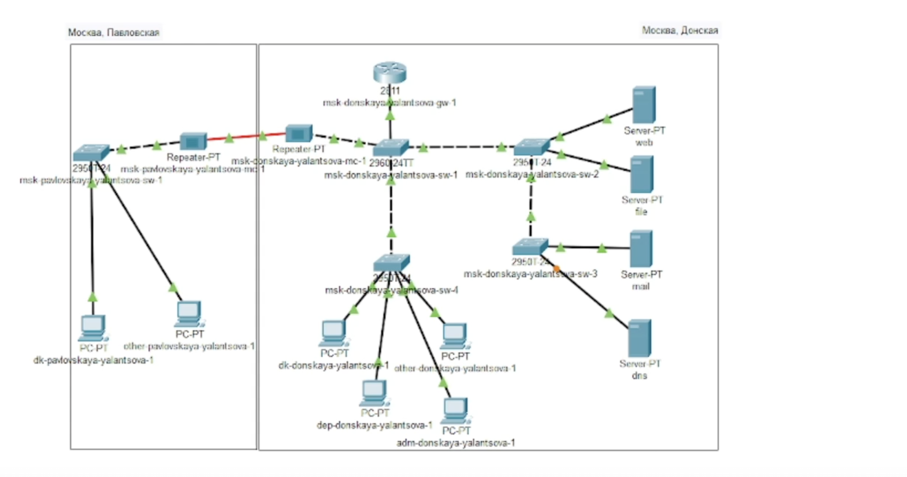
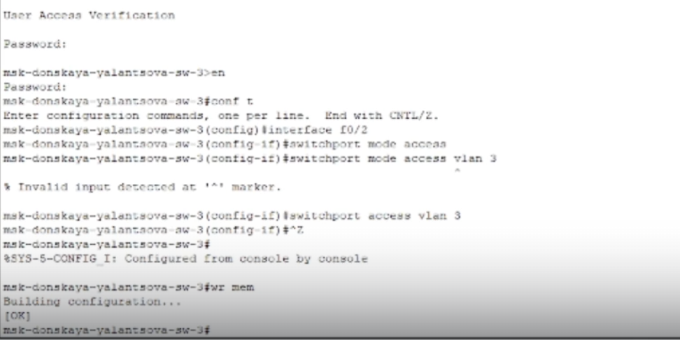
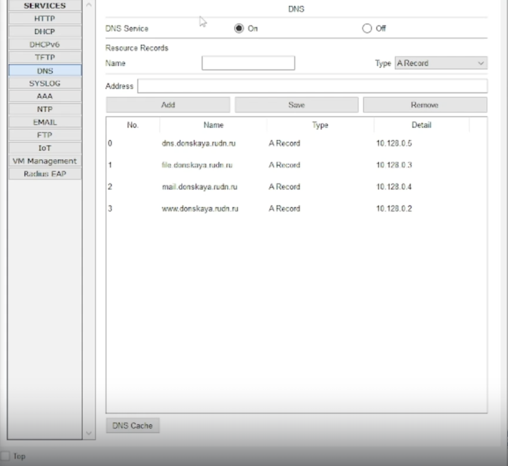
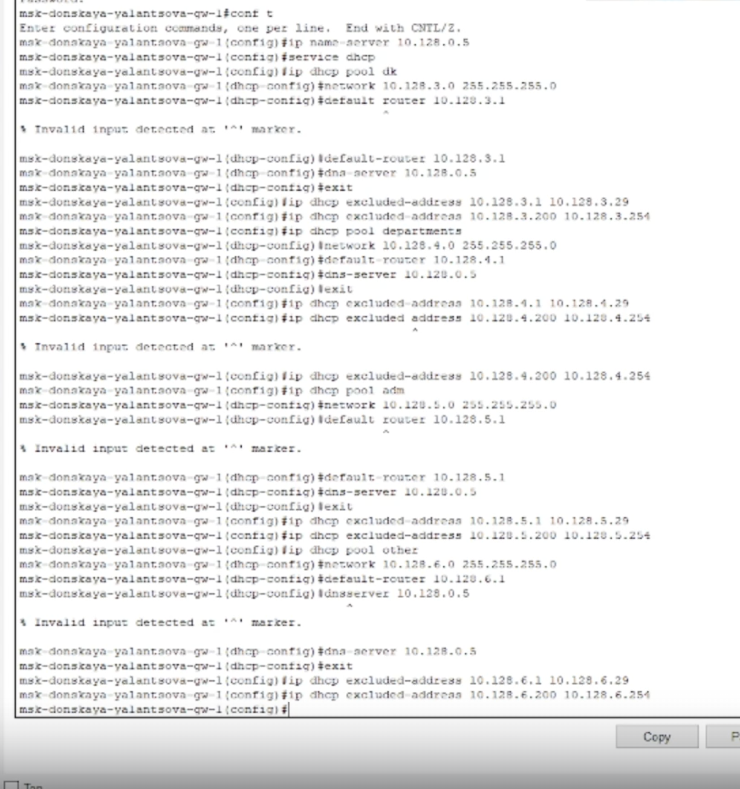
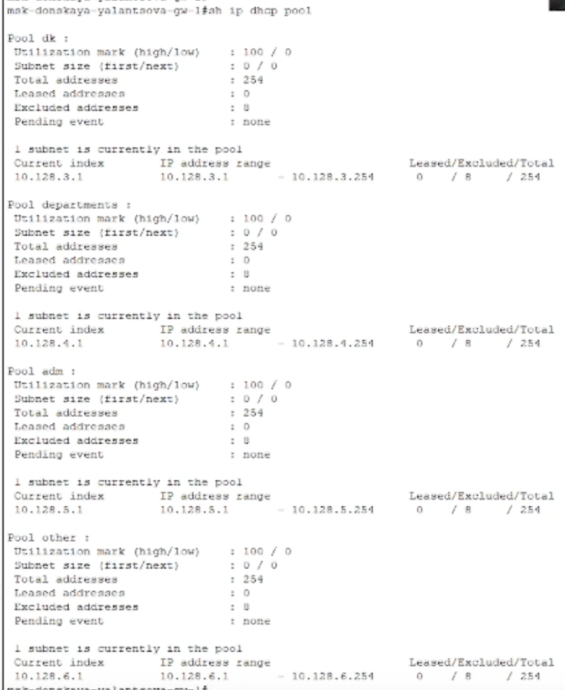
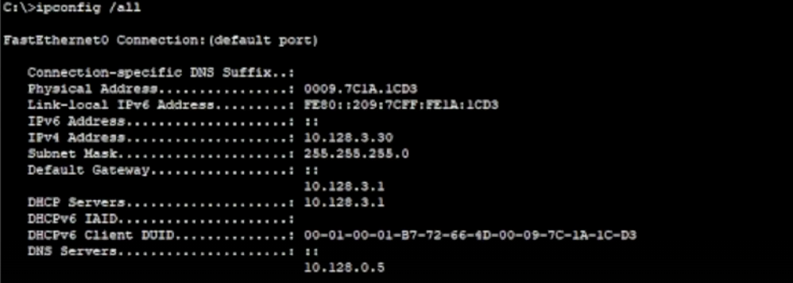
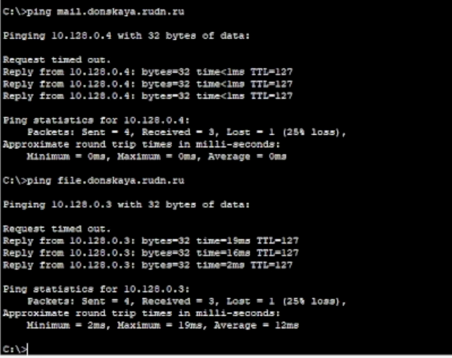
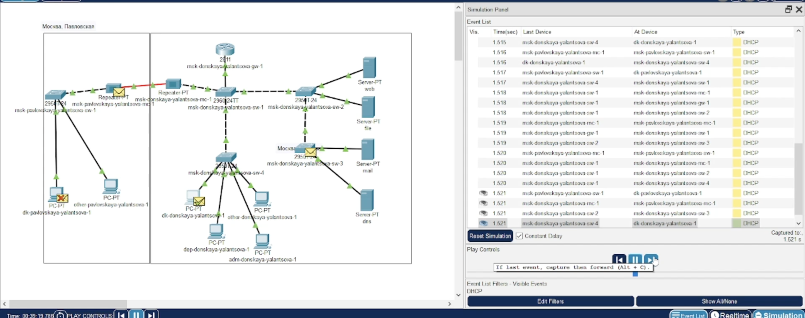

---
## Front matter
title: "Лабораторная работа 8"
subtitle: "Настройка сетевых сервисов. DHCP"
author: "Ланцова Яна Игоревна"

## Generic otions
lang: ru-RU
toc-title: "Содержание"

## Bibliography
bibliography: bib/cite.bib
csl: pandoc/csl/gost-r-7-0-5-2008-numeric.csl

## Pdf output format
toc: true # Table of contents
toc-depth: 2
lof: true # List of figures
lot: true # List of tables
fontsize: 12pt
linestretch: 1.5
papersize: a4
documentclass: scrreprt
## I18n polyglossia
polyglossia-lang:
  name: russian
  options:
    - spelling=modern
    - babelshorthands=true
polyglossia-otherlangs:
  name: english
## I18n babel
babel-lang: russian
babel-otherlangs: english
## Fonts
mainfont: IBM Plex Serif
romanfont: IBM Plex Serif
sansfont: IBM Plex Sans
monofont: IBM Plex Mono
mathfont: STIX Two Math
mainfontoptions: Ligatures=Common,Ligatures=TeX,Scale=0.94
romanfontoptions: Ligatures=Common,Ligatures=TeX,Scale=0.94
sansfontoptions: Ligatures=Common,Ligatures=TeX,Scale=MatchLowercase,Scale=0.94
monofontoptions: Scale=MatchLowercase,Scale=0.94,FakeStretch=0.9
mathfontoptions:
## Biblatex
biblatex: true
biblio-style: "gost-numeric"
biblatexoptions:
  - parentracker=true
  - backend=biber
  - hyperref=auto
  - language=auto
  - autolang=other*
  - citestyle=gost-numeric
## Pandoc-crossref LaTeX customization
figureTitle: "Рис."
tableTitle: "Таблица"
listingTitle: "Листинг"
lofTitle: "Список иллюстраций"
lotTitle: "Список таблиц"
lolTitle: "Листинги"
## Misc options
indent: true
header-includes:
  - \usepackage{indentfirst}
  - \usepackage{float} # keep figures where there are in the text
  - \floatplacement{figure}{H} # keep figures where there are in the text
---

# Цель работы

Приобретение практических навыков по настройке динамического распределения IP-адресов посредством протокола DHCP (Dynamic Host Configuration Protocol) в локальной сети.

# Задание

1. Добавить DNS-записи для домена donskaya.rudn.ru на сервер dns.
2. Настроить DHCP-сервис на маршрутизаторе.
3. Заменить в конфигурации оконечных устройствах статическое распределение адресов на динамическое.
4. При выполнении работы необходимо учитывать соглашение об именовании.

# Выполнение лабораторной работы

Откроем проект прошлой лабораторной работы(рис. [-@fig:001]).

{#fig:001 width=70%}

В логическую рабочую область проекта добавьте сервер dns и подключим его к коммутатору msk-donskaya-yalantsova-sw-3 через порт Fa0/2. В конфигурации сервера укажите в качестве адреса шлюза 10.128.0.1, а в качестве адреса самого сервера — 10.128.0.5 с соответствующей маской 255.255.255.0.(рис. [-@fig:002]).

{#fig:002 width=70%}

Активируем порт,к которому подключен DNS-сервер, на коммутаторе с помощью команд(рис. [-@fig:003]).

{#fig:003 width=70%}

Настроим сервис DNS(рис. [-@fig:004]):
- в конфигурации сервера выберите службу DNS, активируйте её (выбрав
флаг On);
- в поле Type в качестве типа записи DNS выберите записи типа A (A Record);
- в поле Name укажите доменное имя, по которому можно обратиться,
например, к web-серверу — www.donskaya.rudn.ru, затем укажите его
IP-адрес в соответствующем поле 10.128.0.2;
- нажав на кнопку Add , добавьте DNS-запись на сервер;
- аналогичным образом добавьте DNS-записи для серверов mail, file, dns согласно распределению адресов из таблицы  из лабораторной работы 3;
- сохраните конфигурацию сервера.

{#fig:004 width=70%}

Настроим DHCP-сервис на маршрутизаторе(рис. [-@fig:005]), используя приведённые ниже команды для каждой выделенной сети: укажем IP-адрес DNS-сервера; затем перейдем к настройке DHCP; зададим название конфигурируемому диапазону адресов (пулу адресов), укажем адрес сети, а также адреса шлюза и DNS-сервера; зададим пулы адресов, исключаемых из динамического распределениятабл. [-@tbl:plan].

{#fig:005 width=70%}

:Регламент выделения ip-адресов (для сети класса C) {#tbl:iplan}

| IP-адреса | Назначение           |
|-----------|----------------------|
| 1         | Шлюз                 |
| 2-19      | Сетевое оборудование |
| 20-29     | Серверы              |
| 30-199    | Компьютеры, DHCP     |
| 200-219   | Компьютеры, Static   |
| 220-229   | Принтеры             |
| 230-254   | Резерв               |

Просмотрим информацию о пулах DHCP и о привязках выданных адресов(рис. [-@fig:006]).

{#fig:006 width=70%}

Можно увидеть информацию об IP-адресах пулов, шлюзе и диапозоне. Пока что никаие адреса не были выданы, поэтому в информации о привязке ничего нет.

На оконечных устройствах заменим в настройках статическое распределение адресов на динамическое. Можем увидеть, что выделяется c первого адреса из доступного диапазона по-очереди(рис. [-@fig:007]).

{#fig:007 width=70%}

Проверим доступность устройств из разных подсетей(рис. [-@fig:008]).

{#fig:008 width=70%}

В режиме симуляции изучим, каким образом происходит запрос адреса по протоколу DHCP(рис. [-@fig:009]).

{#fig:009 width=90%}

Мы отправили запрос на выделение адреса для устройства donskaya-dk-1. Сначала DHCP-пакет рассылается всем устройствам сети и принимается маршрутизатором. В заголовках DNCP при этом указан только MAC-адрес устройства, которому нужен адрес. Затем маршрутизатор выделяет адрес нужному MAC-адресу на основе информации об уже занятях в этой подсети адресах. Он отпрвляет ответ устройству о том, какой именно адрес выделен. Теперь в заголовках указан адрес шлюза подсети, адрес устройства, а также информация об адресе dns-сервера

# Выводы

В результате выполнения лабораторной работы получили навыки по настройке динамического распределения IP-адресов посредством протокола DHCP в локальной сети.

# Контрольные вопросы

1. За что отвечает протокол DHCP?
2. Какие типы DHCP-сообщений передаются по сети?
3. Какие параметры могут быть переданы в сообщениях DHCP?
4. Что такое DNS?
5. Какие типы записи описания ресурсов есть в DNS и для чего они используются?

1. Протокол DHCP отвечает за динамическое назначение IP-адресов и других сетевых параметров устройствам в сети.
2. Типы DHCP-сообщений: DHCP Discover, DHCP Offer, DHCP Request, DHCP Acknowledge.
3. Параметры DHCP могут включать IP-адреса, шлюзы, DNS-серверы, временные интервалы аренды и другие настройки сети.
4. DNS (Domain Name System) - служит для преобразования доменных имен в IP-адреса и обратно.
5. Типы записей DNS: A (IPv4-адрес), AAAA (IPv6-адрес), CNAME (каноническое имя), MX (почтовый сервер), TXT (текстовая информация) и другие.
