---
## Front matter
title: "Лабораторная работа 9"
subtitle: "Использование протокола STP. Агрегирование каналов"
author: "Ланцова Яна Игоревна"

## Generic otions
lang: ru-RU
toc-title: "Содержание"

## Bibliography
bibliography: bib/cite.bib
csl: pandoc/csl/gost-r-7-0-5-2008-numeric.csl

## Pdf output format
toc: true # Table of contents
toc-depth: 2
lof: true # List of figures
lot: true # List of tables
fontsize: 12pt
linestretch: 1.5
papersize: a4
documentclass: scrreprt
## I18n polyglossia
polyglossia-lang:
  name: russian
  options:
    - spelling=modern
    - babelshorthands=true
polyglossia-otherlangs:
  name: english
## I18n babel
babel-lang: russian
babel-otherlangs: english
## Fonts
mainfont: IBM Plex Serif
romanfont: IBM Plex Serif
sansfont: IBM Plex Sans
monofont: IBM Plex Mono
mathfont: STIX Two Math
mainfontoptions: Ligatures=Common,Ligatures=TeX,Scale=0.94
romanfontoptions: Ligatures=Common,Ligatures=TeX,Scale=0.94
sansfontoptions: Ligatures=Common,Ligatures=TeX,Scale=MatchLowercase,Scale=0.94
monofontoptions: Scale=MatchLowercase,Scale=0.94,FakeStretch=0.9
mathfontoptions:
## Biblatex
biblatex: true
biblio-style: "gost-numeric"
biblatexoptions:
  - parentracker=true
  - backend=biber
  - hyperref=auto
  - language=auto
  - autolang=other*
  - citestyle=gost-numeric
## Pandoc-crossref LaTeX customization
figureTitle: "Рис."
tableTitle: "Таблица"
listingTitle: "Листинг"
lofTitle: "Список иллюстраций"
lotTitle: "Список таблиц"
lolTitle: "Листинги"
## Misc options
indent: true
header-includes:
  - \usepackage{indentfirst}
  - \usepackage{float} # keep figures where there are in the text
  - \floatplacement{figure}{H} # keep figures where there are in the text
---

# Цель работы

Изучение возможностей протокола STP и его модификаций по обеспечению отказоустойчивости сети, агрегированию интерфейсов и перераспределению нагрузки между ними.

# Задание

1. Сформируйте резервное соединение между коммутаторами msk-donskaya-sw-1 и msk-donskaya-sw-3.
2. Настройте балансировку нагрузки между резервными соединениями.
3. Настройте режим Portfast на тех интерфейсах коммутаторов, к которым подключены серверы.
4. Изучите отказоустойчивость резервного соединения.
5. Сформируйте и настройте агрегированное соединение интерфейсов Fa0/20 -- Fa0/23 между коммутаторами msk-donskaya-sw-1 и msk-donskaya-sw-4.

# Выполнение лабораторной работы

Откроем проект прошлой лабораторной работы(рис. [-@fig:001]).

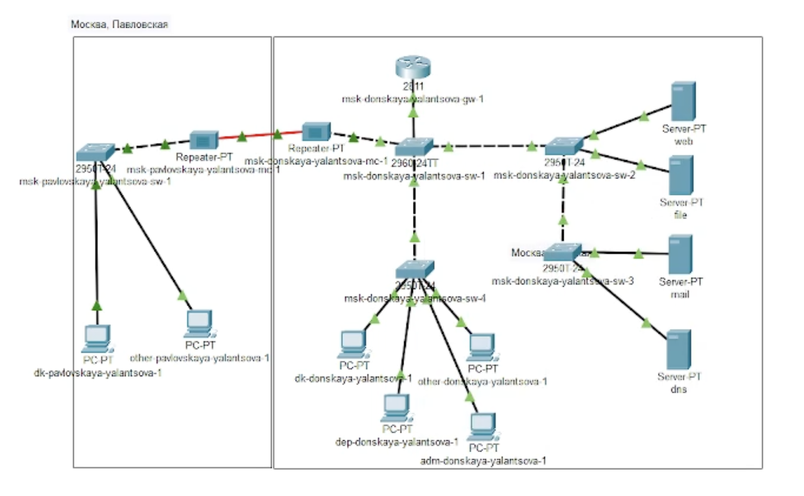{#fig:001 width=70%}

Сформируем резервное соединение между коммутаторами msk-donskaya-yalantsova-sw-1 и msk-donskaya-yalantsova-sw-3 (рис. [-@fig:005]). Для этого:
- заменим соединение между коммутаторами msk-donskaya-sw-1 (Gig0/2) и msk-donskaya-sw-4 (Gig0/1) на соединение между коммутаторами msk-donskaya-yalantsova-sw-1 (Gig0/2) и msk-donskaya-yalantsova-sw-3 (Gig0/2);
- сделаем порт на интерфейсе Gig0/2 коммутатора msk-donskaya-yalantsova-sw-3 транковым (рис. [-@fig:002]):

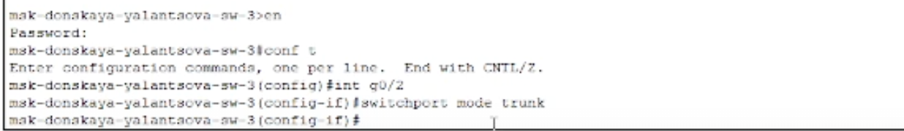{#fig:002 width=70%}

- соединение между коммутаторами msk-donskaya-eademidov-sw-1 и msk-donskaya-eademidov-sw-4 сделаем через интерфейсы Fa0/23, и также активируем их в транковом режиме(рис. [-@fig:003] - [-@fig:004]):

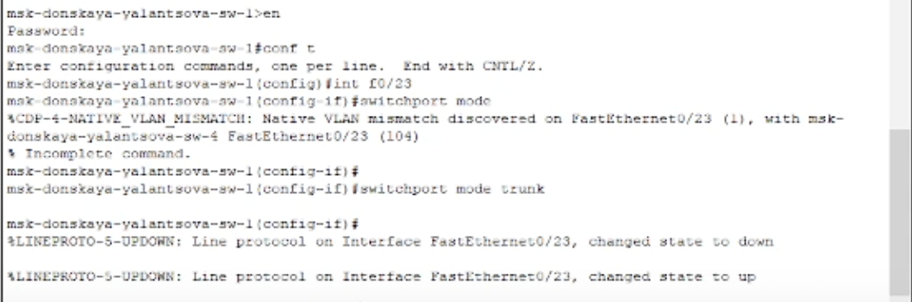{#fig:003 width=70%}

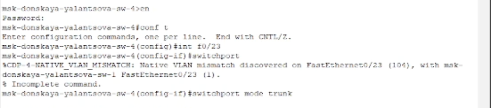{#fig:004 width=70%}

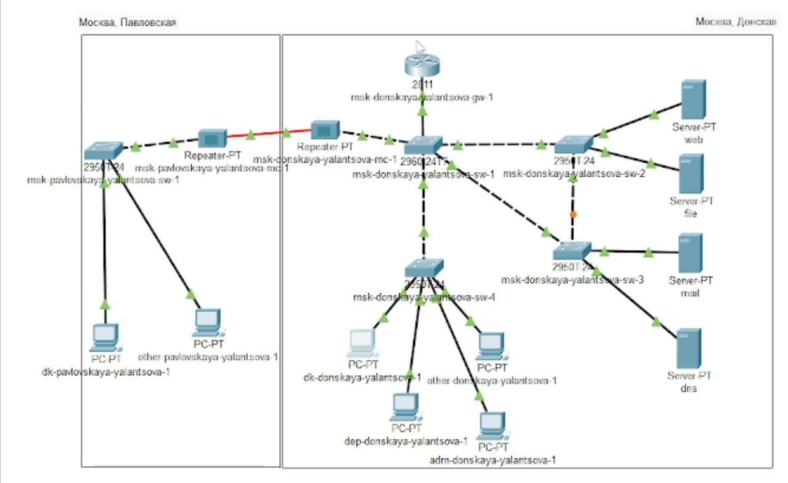{#fig:005 width=70%}

С оконечного устройства dk-donskaya-1 пропингуем серверы mail и web(рис. [-@fig:006]).

{#fig:006 width=70%}

Пакеты успешно отправлены и получены.

В режиме симуляции проследим движение пакетов ICMP. Можно увидеть, что движение пакетов происходит через коммутатор msk-donskaya-yalantsova-sw-2(рис. [-@fig:007]).

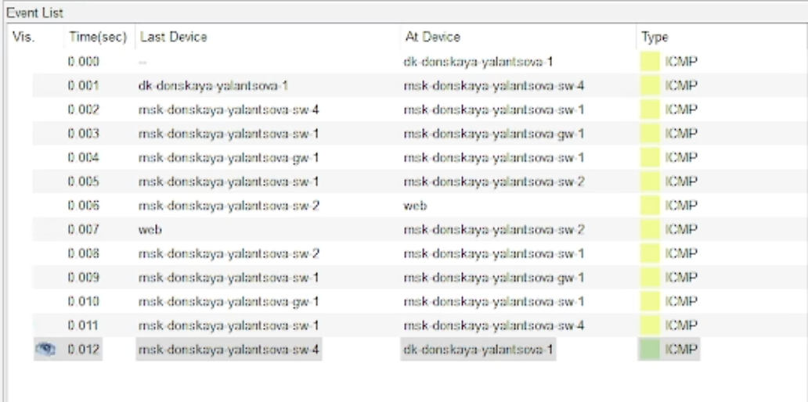{#fig:007 width=70%}

На коммутаторе msk-pavlovskaya-yalantsova-sw-1 посмотрим состояние протокола STP
для vlan 3, также настроим данный коммутатор в качестве корневого коммутатора STP. В результате выведена следующая информация(рис. [-@fig:008]).

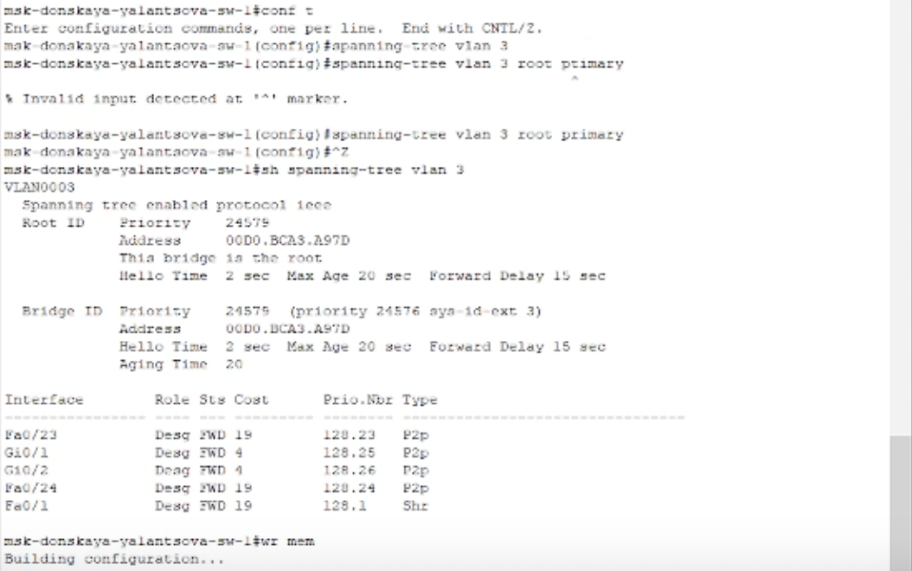{#fig:008 width=70%}

Используя режим симуляции, убедимся, что пакеты ICMP пойдут от хоста dk-donskaya-1 до mail через коммутаторы msk-donskaya-yalantsova-sw-1 и msk-donskaya-yalantsova-sw-3, а от хоста dk-donskaya-1 до web через коммутаторы msk-donskaya-yalantsova-sw-1 и msk-donskaya-yalantsova-sw-2(рис. [-@fig:009]).

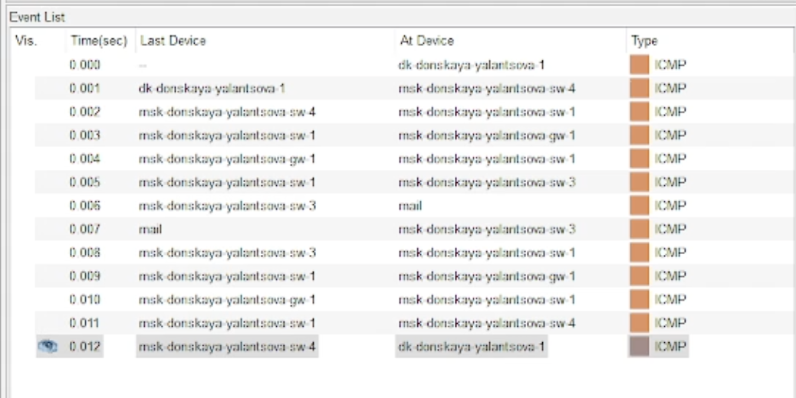{#fig:009 width=90%}

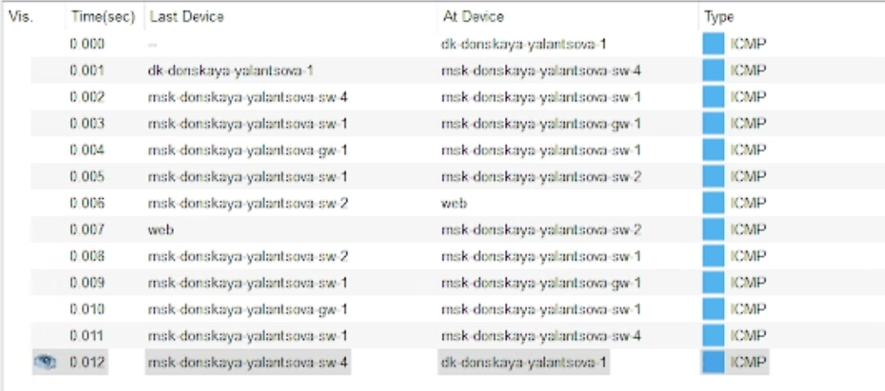{#fig:010 width=90%}

Настроим режим Portfast на тех интерфейсах коммутаторов, к которым подключены серверы, чтобы они при подключении не использовали лишние ресурсы(рис. [-@fig:011], [-@fig:012]).

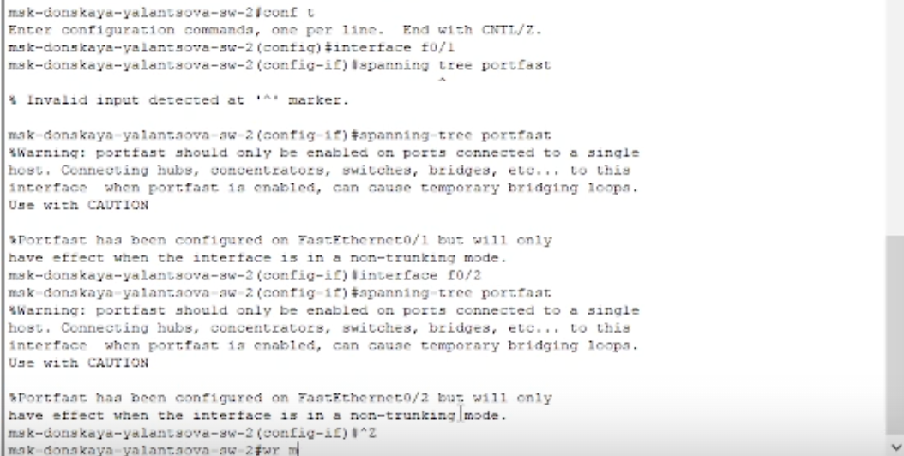{#fig:011 width=90%}

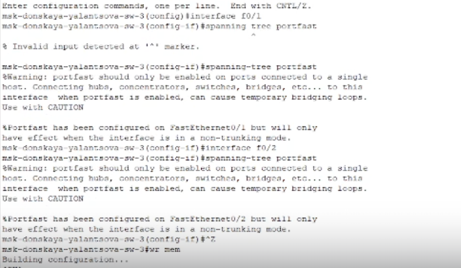{#fig:012 width=90%}

Изучим отказоустойчивость протокола STP и время восстановления соединения при переключении на резервное соединение. Для этого используем команду `ping -n 1000 mail.donskaya.rudn.ru` на хосте dk-donskaya-1, а разрыв соединения обеспечим переводом соответствующего интерфейса коммутатора в состояние shutdown(рис. [-@fig:013]).

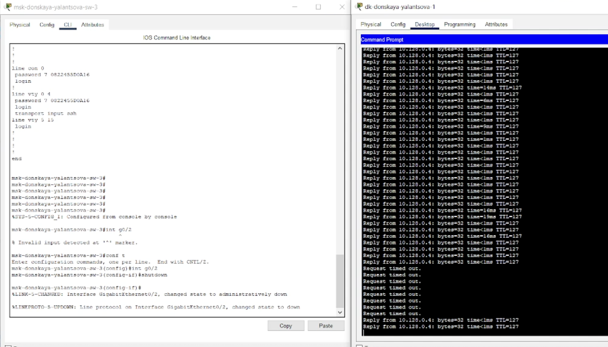{#fig:013 width=90%}

На восстановление требуется время равное пяти пинга.

Переключиим коммутаторы в режим работы по протоколу Rapid PVST+:

```
msk-donskaya-yalantsova-sw-1( config )#spanning-tree mode rapid-pvst
msk-donskaya-yalantsova-sw-2( config )#spanning-tree mode rapid-pvst
msk-donskaya-yalantsova-sw-3( config )#spanning-tree mode rapid-pvst
msk-donskaya-yalantsova-sw-4( config )#spanning-tree mode rapid-pvst
msk-pavlovskaya-yalantsova-sw-1( config )#spanning-tree mode rapid-pvst
```

Изучим отказоустойчивость протокола Rapid PVST+ и время восстановления соединения при переключении на резервное соединение(рис. [-@fig:014]).

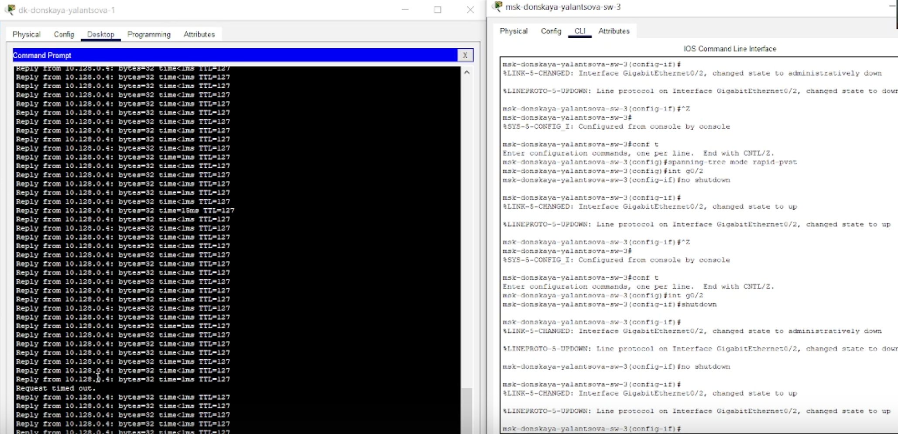{#fig:014 width=90%}

Теперь на восстановление соединения требуется время всего одного пинга.

Сформируем агрегированное соединение интерфейсов Fa0/20 - Fa0/23 между коммутаторами msk-donskaya-yalantsova-sw-1 и msk-donskaya-yalantsova-sw-4(рис. [-@fig:015]).

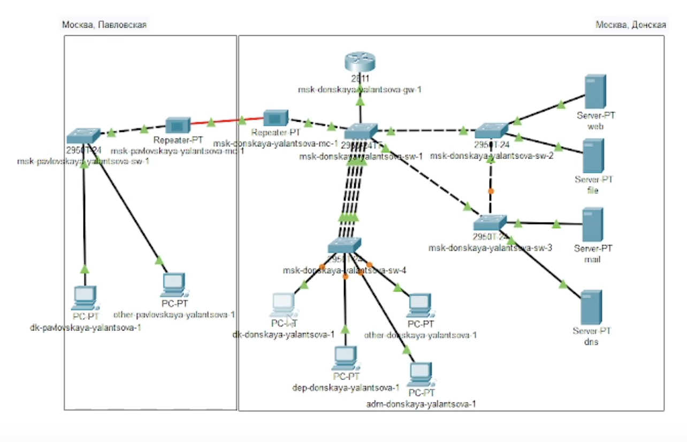{#fig:015 width=90%}

Настроим агрегирование каналов. Сначала отключим на обоих коммутаторах транковый интерфейс Fa0/23. Затем задаем новый интерфейс, объединяющий диапазон адресов Fa0/20 - Fa0/23, и настраиваем на нём статическую агрегацию(рис. [-@fig:016], [-@fig:017]).

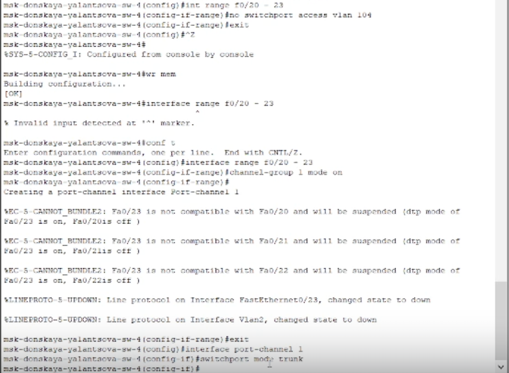{#fig:016 width=90%}

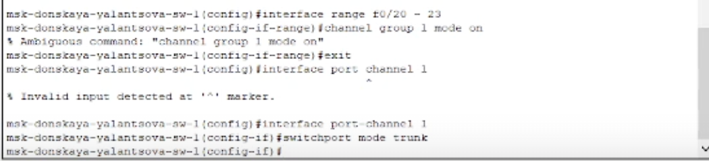{#fig:017 width=90%}

# Выводы

В результате выполнения лабораторной работы изучили возможности протокола STP и его модификаций по обеспечению отказоустойчивости сети, агрегированию интерфейсов и перераспределению нагрузки между ними.

# Контрольные вопросы

1. Какую информацию можно получить, воспользовавшись командой определения состояния протокола STP для VLAN (на корневом и не на корневом устройстве)? Приведите примеры вывода подобной информации на устройствах.

На корневом устройстве можно увидеть обозначение, что оно корневое, а также MAC-адрес корневного устройства и отправителя(в этом случае они совпадают), время жизни сообщения и интервал, через который посылаются пакеты. В случае же не корневного устройства будет также указано расстояние до корневного устройства, и MAC-адрес отправителя будет соответствовать рассматриваемому устройству.

2. При помощи какой команды можно узнать, в каком режиме, STP или Rapid PVST+, работает устройство? Приведите примеры вывода подобной информации на устройствах.

Можно узнать в каком режиме работает устройство посмотрев текующую конфигурацию с помощью команды `show run`.

3. Для чего и в каких случаях нужно настраивать режим Portfast?

PortFast. Это функция протокола STP, которая позволяет Edged Port — порту с подключенным конечным пользователем сразу перейти к состоянию Forwarding, минуя состояния Listening и Learning. Это позволяет ускорить процесс подключения порта. Эту функцию рекомендуется использовать при подключении узлов, чтобы они могли начать обмен данными по сети VLAN немедленно, не дожидаясь протокола spanning-tree. Используется в случаях, когда к порту подключены только оконечные устройства

4. В чем состоит принцип работы агрегированного интерфейса? Для чего он используется?

Агрегированный интерфейс объединяет несколько сетевых интерфейсов для увеличения пропускной способности и обеспечения отказоустойчивости. Он используется для повышения производительности и надежности сетевого соединения.

5. В чём принципиальные отличия при использовании протоколов LACP (Link Aggregation Control Protocol), PAgP (Port Aggregation Protocol) и статического агрегирования без использования протоколов?

LACP и PAgP - динамические протоколы, управляющие созданием и управлением агрегированных соединений. Статическое агрегирование настраивается вручную без использования протоколов.

6. При помощи каких команд можно узнать состояние агрегированного канала EtherChannel?

Для проверки состояния агрегированного канала EtherChannel используются команды "show etherchannel summary" и "show etherchannel port-channel".

