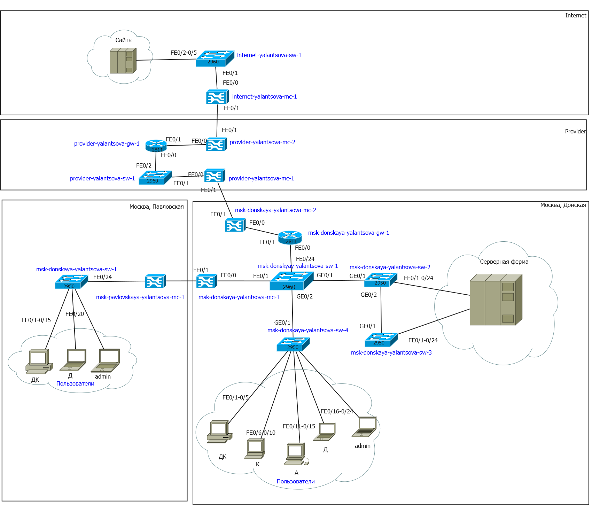
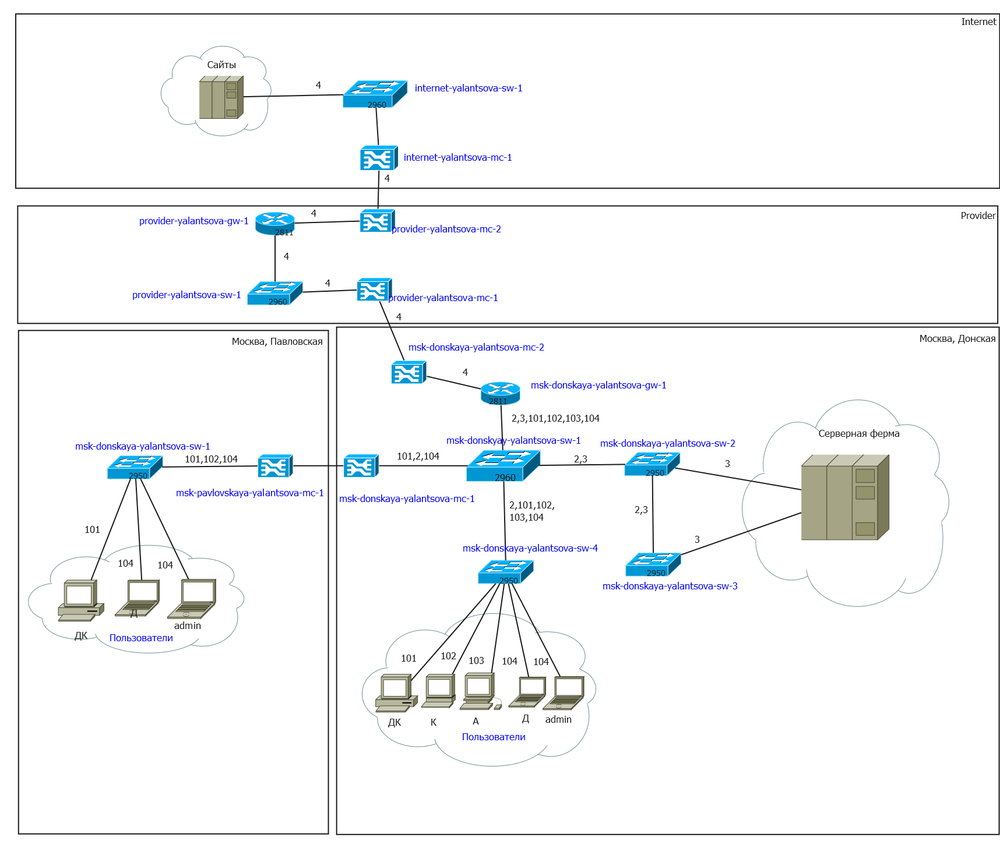
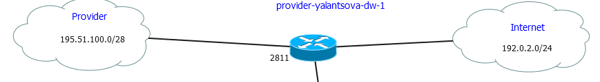
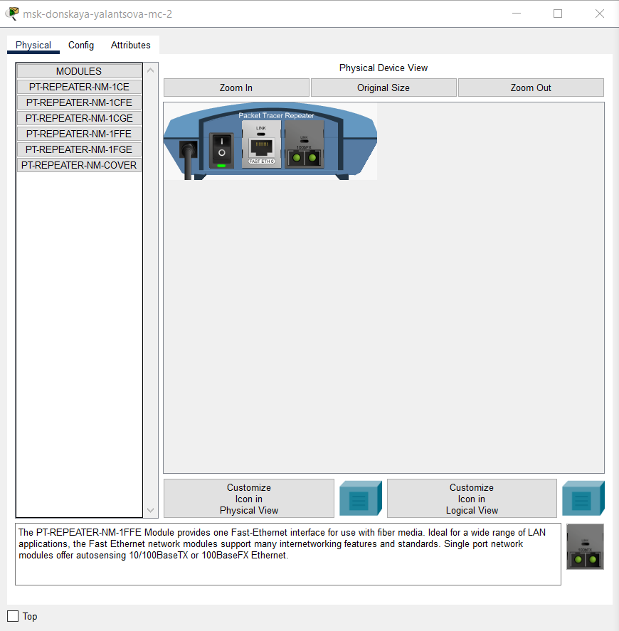
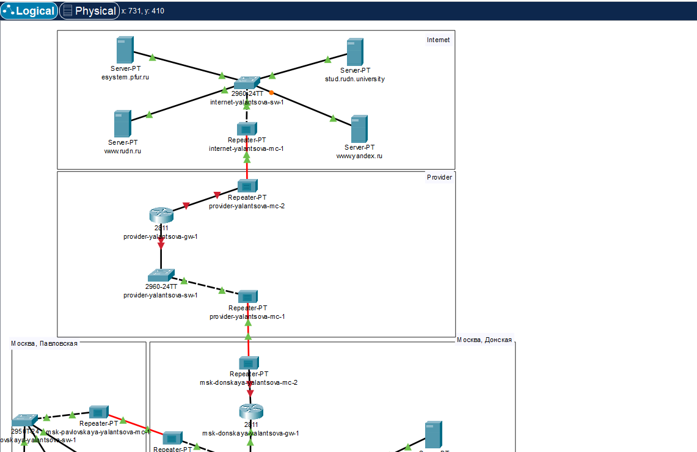
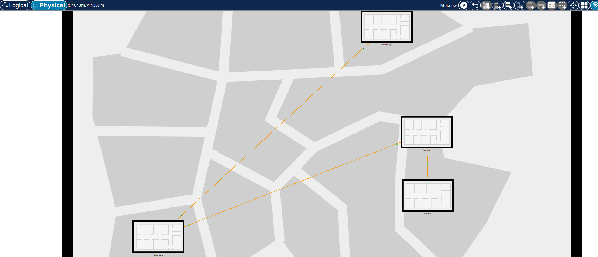
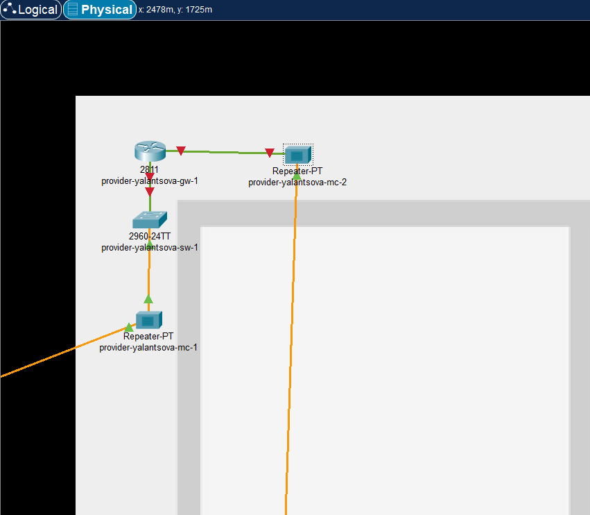
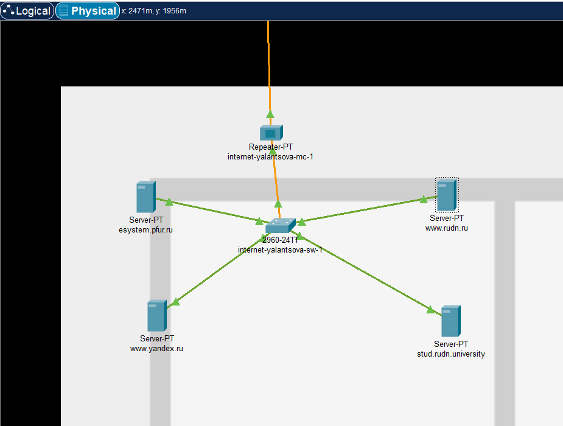
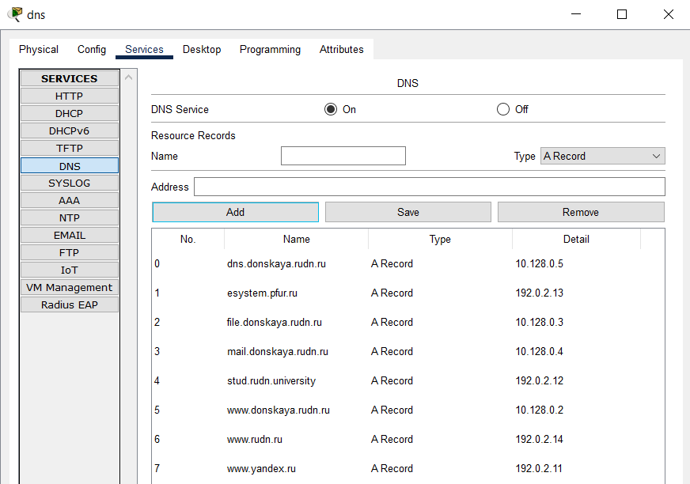

---
## Front matter
title: "Лабораторная работа 11"
subtitle: "Настройка NAT. Планирование"
author: "Ланцова Яна Игоревна"

## Generic otions
lang: ru-RU
toc-title: "Содержание"

## Bibliography
bibliography: bib/cite.bib
csl: pandoc/csl/gost-r-7-0-5-2008-numeric.csl

## Pdf output format
toc: true # Table of contents
toc-depth: 2
lof: true # List of figures
lot: true # List of tables
fontsize: 12pt
linestretch: 1.5
papersize: a4
documentclass: scrreprt
## I18n polyglossia
polyglossia-lang:
  name: russian
  options:
    - spelling=modern
    - babelshorthands=true
polyglossia-otherlangs:
  name: english
## I18n babel
babel-lang: russian
babel-otherlangs: english
## Fonts
mainfont: IBM Plex Serif
romanfont: IBM Plex Serif
sansfont: IBM Plex Sans
monofont: IBM Plex Mono
mathfont: STIX Two Math
mainfontoptions: Ligatures=Common,Ligatures=TeX,Scale=0.94
romanfontoptions: Ligatures=Common,Ligatures=TeX,Scale=0.94
sansfontoptions: Ligatures=Common,Ligatures=TeX,Scale=MatchLowercase,Scale=0.94
monofontoptions: Scale=MatchLowercase,Scale=0.94,FakeStretch=0.9
mathfontoptions:
## Biblatex
biblatex: true
biblio-style: "gost-numeric"
biblatexoptions:
  - parentracker=true
  - backend=biber
  - hyperref=auto
  - language=auto
  - autolang=other*
  - citestyle=gost-numeric
## Pandoc-crossref LaTeX customization
figureTitle: "Рис."
tableTitle: "Таблица"
listingTitle: "Листинг"
lofTitle: "Список иллюстраций"
lotTitle: "Список таблиц"
lolTitle: "Листинги"
## Misc options
indent: true
header-includes:
  - \usepackage{indentfirst}
  - \usepackage{float} # keep figures where there are in the text
  - \floatplacement{figure}{H} # keep figures where there are in the text
---

# Цель работы

Провести подготовительные мероприятия по подключению локальной сети организации к Интернету.

# Задание

1. Построить схему подсоединения локальной сети к Интернету.
2. Построить модельные сети провайдера и сети Интернет.
3. Построить схемы сетей L1, L2, L3.

Модельные предположения:

- В сети провайдера располагаются 2 медиаконвертера provider-mc-1 и provider-mc-2 для связи с подсетью «Донская» и сетью модельного Интернета, маршрутизатор provider-gw-1 и коммутатор provider-sw-1. Оборудование соединяется между собой по Fast Ethernet согласно схеме.
- В модельной сети Интернет располагаются 4 сервера www.yandex.ru, www.rudn.ru, stud.rudn.university и esystem.pfur.ru, коммутатор internet-sw-1 и медиаконвертер internet-mc-1 для связи с сетью провайдера. Серверы подключены к коммутатору посредством Fast Ethernet, коммутатор подсоединён к медиаконвертеру также по Fast Ethernet.
- Имена и адреса серверам Интернета и маршрутизатору провайдера задаются согласно табл. [-@tbl:ip]. При этом учитывается, что под сеть адресов модельного Интернета выделяется адрес 192.0.2.0/24, а под сеть провайдера
- 198.51.100.1 (как рекомендовано в [4] для использования в примерах и документации при описании тестовых сетей).

: Распределение ip-адресов модельного Интернета {#tbl:ip}

| IP-адреса     | Примечание            |
|---------------|-----------------------|
| 192.0.2.1     | provider-gw-1         |
| 192.0.2.11    | www.yandex.ru         |
| 192.0.2.12    | stud.rudn.university  |
| 192.0.2.13    | esystem.pfur.ru       |
| 192.0.2.14    | www.rudn.ru           |

# Выполнение лабораторной работы

Внесем изменения в схему L1 сети, добавив в неё сеть провайдера и сеть модельного Интернета с указанием названий оборудования и портов подключения(рис. [-@fig:001]).

{#fig:001 width=70%}

Внесем изменения в схемы L2(рис. [-@fig:002]) и L3 (рис. [-@fig:003]) сети, указав адреса и VLAN сети провайдера и модельной сети Интернета.

{#fig:002 width=90%}

{#fig:003 width=90%}

Скорректируем таблицы распределения IP-адресов (табл. [-@tbl:ipplan]) и портов (табл. [-@tbl:port]).

: Таблица портов {#tbl:port}

| Устройство           | Порт          | Примечание           | Access VLAN | Trunk VLAN               |
|----------------------|---------------|----------------------|-------------|--------------------------|
| msk-donskaya-gw-1    | f0/1          | provider-mc-1        |             |                          |
|                      | f0/0          | msk-donskaya-sw-1    |             | 2, 3, 101, 102, 103, 104 |
| msk-donskaya-sw-1    | f0/24         | msk-donskaya-gw-1    |             | 2, 3, 101, 102, 103, 104 |
|                      | f0/20 — f0/23 | msk-donskaya-sw-4    |             | 2, 3                     |
|                      | g0/1          | msk-donskaya-sw-2    |             |                          |
|                      | g0/2          | msk-donskaya-sw-3    |             | 2, 101, 102, 103, 104    |
|                      | f0/1          | msk-donskaya-mc-1    |             | 2, 101, 104              |
| msk-donskaya-sw-2    | g0/1          | msk-donskaya-sw-1    |             | 2, 3                     |
|                      | g0/2          | msk-donskaya-sw-3    |             | 2, 3                     |
|                      | f0/1          | Web-server           | 3           |                          |
|                      | f0/2          | File-server          | 3           |                          |
| msk-donskaya-sw-3    | g0/1          | msk-donskaya-sw-2    |             | 2, 3                     |
|                      | g0/2          | msk-donskaya-sw-1    |             |                          |
|                      | f0/1          | Mail-server          | 3           |                          |
|                      | f0/2          | Dns-server           | 3           |                          |
| msk-donskaya-sw-4    | f0/20 — f0/23 | msk-donskaya-sw-1    |             | 2, 101, 102, 103, 104    |
|                      | f0/1–f0/5     | dk                   | 101         |                          |
|                      | f0/6–f0/10    | departments          | 102         |                          |
|                      | f0/11–f0/15   | adm                  | 103         |                          |
|                      | f0/16–f0/24   | other                | 104         |                          |
|                      | f0/24         | admin                | 104         |                          |
| msk-donskaya-mc-1    | f0/0          | msk-donskaya-sw-1    |             |                          |
|                      | f0/1          | msk-donskaya-mc-1    |             |                          |
| msk-donskaya-mc-2    | f0/0          | msk-donskaya-gw-1    |             |                          |
|                      | f0/1          | provider-mc-1        |             |                          |
| msk-pavlovskaya-mc-1 | f0/0          | msk-pavlovskaya-sw-1 |             |                          |
|                      | f0/1          | msk-donskaya-mc-1    |             |                          |
| msk-pavlovskaya-sw-1 | f0/24         | msk-pavlovskaya-mc-1 |             | 2, 101, 104              |
|                      | f0/1–f0/15    | dk                   | 101         |                          |
|                      | f0/20         | other                | 104         |                          |
|                      | f0/24         | admin-pavlovskaya    | 104         |                          |
| provider-gw-1        | f0/0          | provider-sw-1        |             |                          |
|                      | f0/1          | provider-mc-2        |             |                          |
| provider-sw-1        | f0/1          | provider-mc-1        |             |                          |
|                      | f0/2          | provider-gw-1        |             |                          |
| provider-mc-1        | f0/0          | provider-sw-1        |             |                          |
|                      | f0/1          | msk-donskaya-mc-2    |             |                          |
| provider-mc-2        | f0/0          | provider-gw-1        |             |                          |
|                      | f0/1          | internet-mc-1        |             |                          |
| internet-sw-1        | f0/1          | internet-mc-1        |             |                          |
|                      | f0/2          | esystem.pfur.ru      |             |                          |
|                      | f0/3          | www.rudn.ru          |             |                          |
|                      | f0/4          | stud.rudn.university |             |                          |
|                      | f0/5          | www.yandex.ru        |             |                          |
| internet-mc-1        | f0/0          | internet-sw-1        |             |                          |
|                      | f0/1          | provider-mc-2        |             |                          |

: Таблица IP {#tbl:ipplan}

| IP-адреса               | Примечание              | VLAN |
|-------------------------|-------------------------|------|
| 10.128.0.0/16           | Вся сеть                |      |
| 10.128.0.0/24           | Серверная ферма         | 3    |
| 10.128.0.1              | Шлюз                    |      |
| 10.128.0.2              | Web                     |      |
| 10.128.0.3              | File                    |      |
| 10.128.0.4              | Mail                    |      |
| 10.128.0.5              | Dns                     |      |
| 10.128.0.6-10.128.0.254 | Зарезервировано         |      |
| 10.128.1.0/24           | Управление              | 2    |
| 10.128.1.1              | Шлюз                    |      |
| 10.128.1.2              | msk-donskaya-sw-1       |      |
| 10.128.1.3              | msk-donskaya-sw-2       |      |
| 10.128.1.4              | msk-donskaya-sw-3       |      |
| 10.128.1.5              | msk-donskaya-sw-4       |      |
| 10.128.1.6              | msk-pavlovskaya-sw-1    |      |
| 10.128.1.7-10.128.1.254 | Зарезервировано         |      |
| 10.128.2.0/24           | Cеть Point-to-Point     |      |
| 10.128.2.1              | Шлюз                    |      |
| 10.128.2.2-10.128.2.254 | Зарезервировано         |      |
| 10.128.3.0/24           | Дисплейные классы (ДК)  | 101  |
| 10.128.3.1              | Шлюз                    |      |
| 10.128.3.2-10.128.3.254 | Пул для пользователей   |      |
| 10.128.4.0/24           | Кафедры (К)             | 102  |
| 10.128.4.1              | Шлюз                    |      |
| 10.128.4.2-10.128.4.254 | Пул для пользователей   |      |
| 10.128.5.0/24           | Администрация (А)       | 103  |
| 10.128.5.1              | Шлюз                    |      |
| 10.128.5.2-10.128.5.254 | Пул для пользователей   |      |
| 10.128.6.0/24           | Другие пользователи (Д) | 104  |
| 10.128.6.1              | Шлюз                    |      |
| 10.128.6.2-10.128.6.254 | Пул для пользователей   |      |
| 192.0.2.1               | provider-gw-1           |      |
| 192.0.2.11              | www.yandex.ru           | 4    |
| 192.0.2.12              | stud.rudn.university    | 4    |
| 192.0.2.13              | esystem.pfur.ru         | 4    |
| 192.0.2.14              | www.rudn.ru             | 4    |

На схеме предыдущего проекта разместим необходимое оборудование для сети провайдера и сети модельного Интернета: 4 медиаконвертера (Repeater-PT), 2 коммутатора типа Cisco 2960-24TT, маршрутизатор типа Cisco 2811, 4 сервера. Присвоим названия размещённым в сети провайдера и в сети модельного Интернета объектам согласно модельным предположениям и схеме L1. Затем заменим модули на медиаконвертерах для подключения Fast Ethernet(модуль PT-REPEATER-NM-1FFE) и оптоволокна( модульPT-REPEATER-NM-1CFE)(рис. [-@fig:004]).

{#fig:004 width=70%}

Соединим устройства согласно схеме L1(рис. [-@fig:005]).

{#fig:005 width=70%}

В физической рабочей области добавим здание провайдера и здание, имитирующее расположение серверов модельного Интернета. Присвоим им соответствующие названия(рис. [-@fig:006]).

{#fig:006 width=70%}

Перенесем из сети «Донская» оборудование провайдера(рис. [-@fig:007]) и модельной сети Интернета(рис. [-@fig:008]) в соответствующие здания.

{#fig:007 width=90%}

{#fig:008 width=90%}

Пропишем IP-адреса серверам согласно табл. [-@tbl:ip]. Пропишем сведения о серверах на DNS-сервере сети «Донская(рис. [-@fig:009]).

{#fig:009 width=90%}

# Выводы

В результате выполнения лабораторной работы провели подготовительные мероприятия по подключению локальной сети организации к Интернету.

# Контрольные вопросы

1. Что такое Network Address Translation (NAT)?

Network Address Translation (NAT) — механизм преобразования IP-адресов транзитных пакетов. В частности, механизм NAT используется для обеспечения доступа устройств локальных сетей с внутренними IP-адресами к сети Интернет.

2. Как определить, находится ли узел сети за NAT?

Одним из способов является анализ конфигурации маршрутизатора или другого сетевого оборудования, которое может выполнять функции NAT. 

3. Какое оборудование отвечает за преобразование адреса методом NAT?

Оборудование, отвечающее за преобразование адреса методом NAT, включает в себя маршрутизаторы, коммутаторы и другие устройства сетевой инфраструктуры. Компании, такие как Cisco Systems и Huawei, предлагают оборудование, способное выполнять функции NAT. Например, устройства Cisco Systems, такие как маршрутизаторы с операционной системой IOS, могут выполнять NAT и обеспечивать преобразование адресов в сети.

4. В чём отличие статического, динамического и перегруженного NAT?

Статический осуществляет преобразование адресов по принципу 1:1, динамический 1:N, а перегруженный N:1.

5. Охарактеризуйте типы NAT.

Типы NAT:
- статический NAT (Static NAT, SNAT) -- осуществляет преобразование адресов по принципу 1:1 (в частности, один локальный IP-адрес преобразуется во внешний адрес, выделенный, например, провайдером);
- динамический NAT (Dynamic NAT, DNAT) -- осуществляет преобразование адресов по принципу 1:N (например, один адрес устройства локальной сети преобразуется в один из адресов диапазона внешних адресов);
- NAT Overload (или NAT Masquerading, или Port Address Translation, PAT) -- осуществляет преобразование адресов по принципу N:1 (например, адреса группы устройств локальной подсети преобразуются в один внешний адрес, при этом дополнительно используется механизм адресации через номера портов).
