---
## Front matter
title: "Лабораторная работа 13"
subtitle: "Статическая маршрутизация в Интернете. Планирование"
author: "Ланцова Яна Игоревна"

## Generic otions
lang: ru-RU
toc-title: "Содержание"

## Bibliography
bibliography: bib/cite.bib
csl: pandoc/csl/gost-r-7-0-5-2008-numeric.csl

## Pdf output format
toc: true # Table of contents
toc-depth: 2
lof: true # List of figures
lot: true # List of tables
fontsize: 12pt
linestretch: 1.5
papersize: a4
documentclass: scrreprt
## I18n polyglossia
polyglossia-lang:
  name: russian
  options:
    - spelling=modern
    - babelshorthands=true
polyglossia-otherlangs:
  name: english
## I18n babel
babel-lang: russian
babel-otherlangs: english
## Fonts
mainfont: IBM Plex Serif
romanfont: IBM Plex Serif
sansfont: IBM Plex Sans
monofont: IBM Plex Mono
mathfont: STIX Two Math
mainfontoptions: Ligatures=Common,Ligatures=TeX,Scale=0.94
romanfontoptions: Ligatures=Common,Ligatures=TeX,Scale=0.94
sansfontoptions: Ligatures=Common,Ligatures=TeX,Scale=MatchLowercase,Scale=0.94
monofontoptions: Scale=MatchLowercase,Scale=0.94,FakeStretch=0.9
mathfontoptions:
## Biblatex
biblatex: true
biblio-style: "gost-numeric"
biblatexoptions:
  - parentracker=true
  - backend=biber
  - hyperref=auto
  - language=auto
  - autolang=other*
  - citestyle=gost-numeric
## Pandoc-crossref LaTeX customization
figureTitle: "Рис."
tableTitle: "Таблица"
listingTitle: "Листинг"
lofTitle: "Список иллюстраций"
lotTitle: "Список таблиц"
lolTitle: "Листинги"
## Misc options
indent: true
header-includes:
  - \usepackage{indentfirst}
  - \usepackage{float} # keep figures where there are in the text
  - \floatplacement{figure}{H} # keep figures where there are in the text
---

# Цель работы

Провести подготовительные мероприятия по организации взаимодействия через сеть провайдера посредством статической маршрутизации локальной сети с сетью основного здания, расположенного в 42-м квартале в Москве, и сетью филиала, расположенного в г. Сочи.

# Задание

1. Внести изменения в схемы L1, L2 и L3 сети, добавив в них информацию о сети основной территории (42-й квартал в Москве) и сети филиала в г. Сочи.
2. Дополнить схему проекта, добавив подсеть основной территории организации 42-го квартала в Москве и подсеть филиала в г. Сочи.
3. Сделать первоначальную настройку добавленного в проект оборудования.

# Выполнение лабораторной работы

## Планирование

Внесем изменения в схему L1 сети, добавив в неё сеть квартала 42 и сеть в Сочи с указанием названий оборудования и портов подключения(рис. [-@fig:001]).

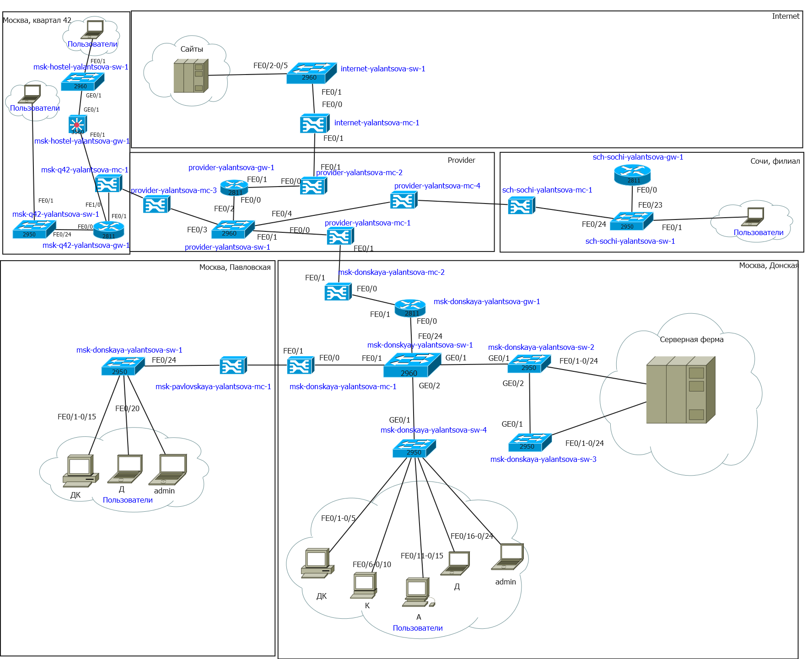{#fig:001 width=70%}

Внесем изменения в схемы L2(рис. [-@fig:002]) и L3 (рис. [-@fig:003]) сети, указав ip-адреса и VLAN.

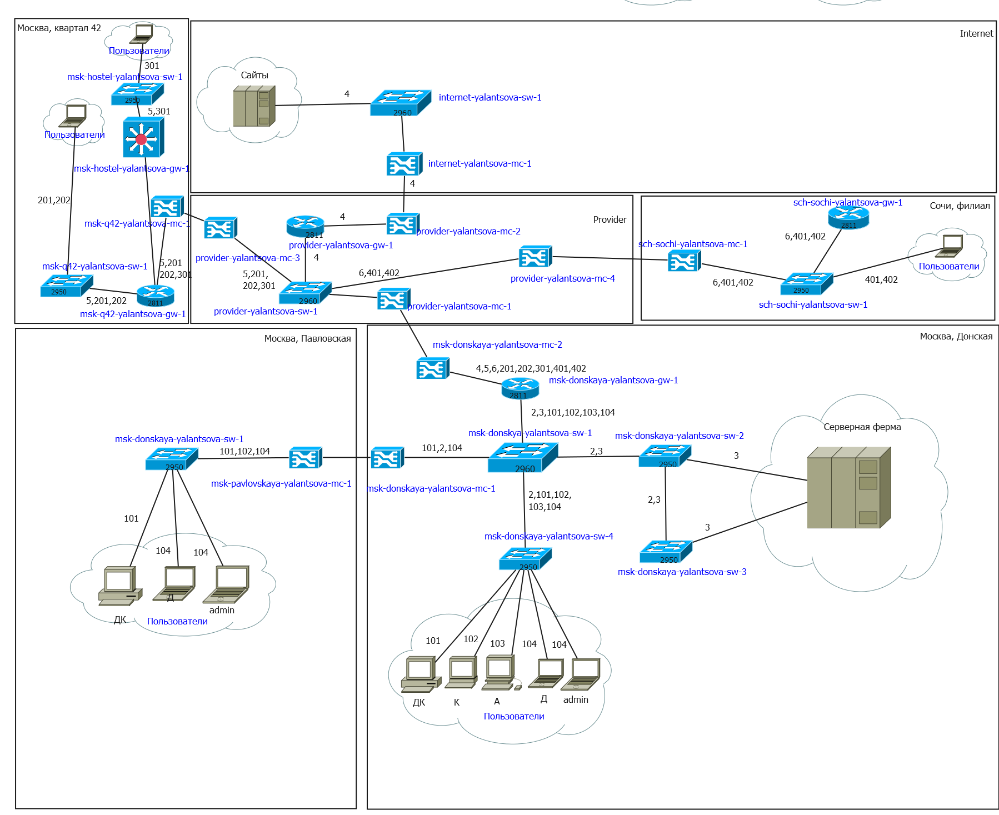{#fig:002 width=70%}

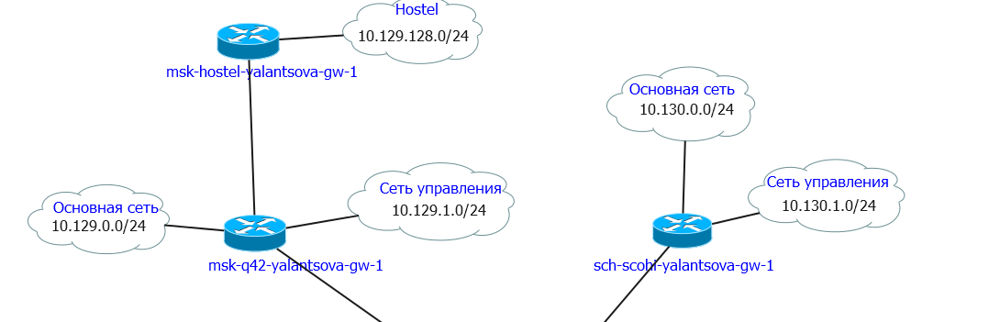{#fig:003 width=70%}

Скорректируем таблицу VLAN(табл. [-@tbl:vlan]), добавим распределение IP-адресов в Сочи (табл. [-@tbl:ipsch]) и для связующих разные территории линков (табл. [-@tbl:iplink]).

: Таблица VLAN {#tbl:vlan}

| № VLAN       | Имя VLAN         | Примечание                                          |
|--------------|------------------|-----------------------------------------------------|
| 1            | default          | Не используется                                     |
| 2            | management       | Для управления устройствами                         |
| 3            | servers          | Для серверной фермы                                 |
| 4            | nat              | Зарезервировано                                     |
| 5            | q42              | Линк в сеть квартала 42 в Москве                    |
| 6            | sochi            | Линк в сеть филиала в Сочи                          |
| 101          | dk               | Дисплейные классы (ДК)                              |
| 102          | departments      | Кафедры                                             |
| 103          | adm              | Администрация                                       |
| 104          | other            | Для других пользователей                            |
| 201          | q42-main         | Основной для квартала 42 в Москве                   |
| 202          | q42-management   | Для управления устройствами 42-го квартала в Москве |
| 301          | hostel-main      | Основной для общежитий в квартале 42 в Москве       |
| 401          | sochi-main       | Основной для филиала в Сочи                         |
| 402          | sochi-management | Для управления устройствами в филиала в Сочи        |

: Таблица IP для филиала в г. Сочи {#tbl:ipsch}

| IP-адреса                        | Примечание                              | VLAN |
|----------------------------------|-----------------------------------------|------|
| 10.130.0.0/16                    | Вся сеть филиала в Сочи                 |      |
| 10.130.0.0/24                    | Основная сеть филиала в Сочи            | 401  |
| 10.130.0.1                       | sch-sochi-gw-1                          |      |
| 10.130.0.200                     | pc-sochi-1                              |      |
| 10.130.1.0/24                    | Сеть для управления устройствами в Сочи | 402  |
| 10.130.1.1                       | sch-sochi-gw-1                          |      |

: Таблица IP для связующих разные территории линков {#tbl:iplink}
                                                             
| IP-адреса                                         | Примечание                                                   | VLAN |
|---------------------------------------------------|--------------------------------------------------------------|------|
| 10.128.255.0/24                                   | Вся сеть для линков                                          |      |
| 10.128.255.0/30                                   | Линк на 42-й квартал                                         | 5    |
| 10.128.255.1                                      | msk-donskaya-gw-1                                            |      |
| 10.128.255.2                                      | msk-q42-gw-1                                                 |      |
| 10.128.255.4/30                                   | Линк в Сочи 6                                                | 6    |
| 10.128.255.5                                      | msk-donskaya-gw-1                                            |      |
| 10.128.255.6                                      | sch-sochi-gw-1                                               |      |
| 10.129.0.0/16                                     | Вся сеть квартала 42 в Москве                                |      |
| 10.129.0.0/24                                     | Основная сеть квартала 42 в Москве                           | 201  |
| 10.129.0.1                                        | msk-q42-gw-1                                                 |      |
| 10.129.0.200                                      | pc-q42-1                                                     |      |
| 10.129.1.0/24                                     | Сеть для управления устройствами в сети квартала 42 в Москве | 202  |
| 10.129.1.1                                        | msk-q42-gw-1                                                 |      |
| 10.129.1.2                                        | msk-hostel-gw-1                                              |      |
| 10.129.128.0/17                                   | Вся сеть hostel                                              |      |
| 10.129.128.0/24                                   | Основная сеть hostel                                         | 301  |
| 10.129.128.1                                      | msk-hostel-gw-1                                              |      |
| 10.129.128.200                                    | pc-hostel-1                                                  |      |

## Первоначальная настройка оборудования

На схеме предыдущего проекта разместим необходимое оборудование для сети провайдера и сети модельного Интернета: 4 медиаконвертера (Repeater-PT), 2 маршрутизатора типа Cisco 2811, 1 маршрутизирующий коммутатор типа Cisco 3560-24PS, 2 коммутатора типа Cisco 2950-24, коммутатор Cisco 2950-24T, 3 оконечных устройства типа PC-PT. Затем присвоим названия в соответствии с планом.

На медиаконвертерах заменим имеющиеся модули ли на PT-REPEATER-NM-1FFE и PT-REPEATER-NM-1CFE для подключения витой пары по технологии Fast Ethernet и оптоволокна соответственно(рис. [-@fig:004]).

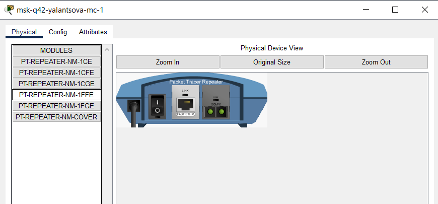{#fig:004 width=70%}

На маршрутизаторе msk-q42-gw-1 добавим дополнительный интерфейс NM-2FE2Wс(рис. [-@fig:005]).

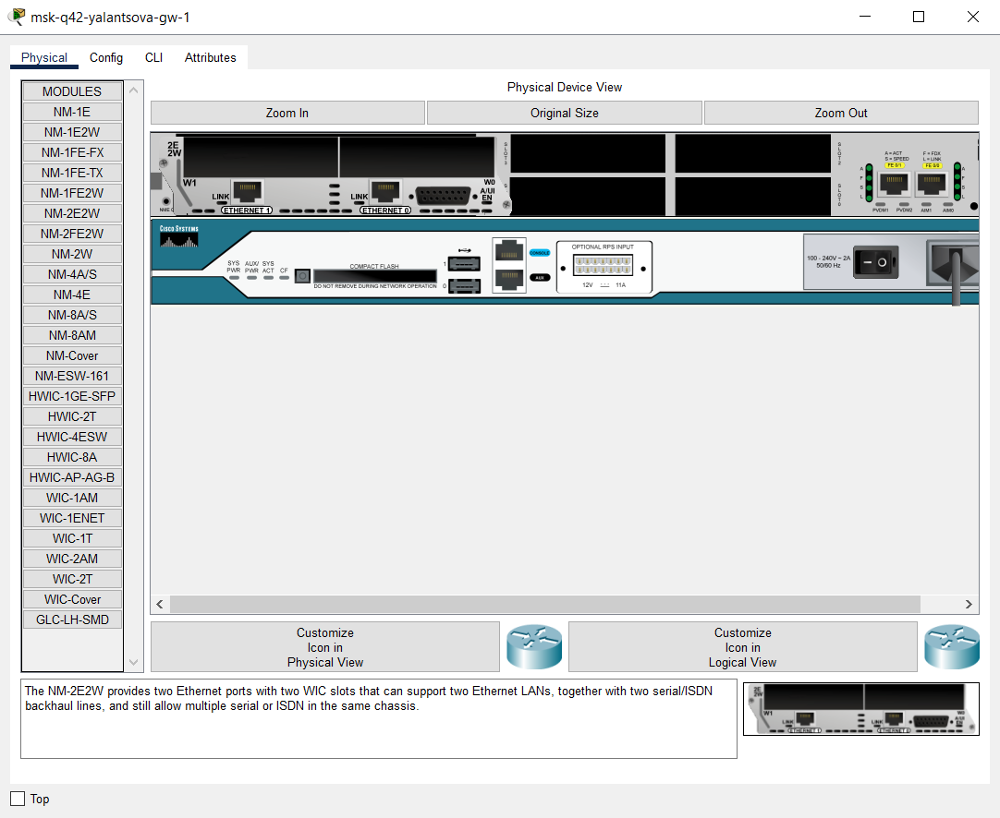{#fig:005 width=70%}

В физической рабочей области Packet Tracer добавим добавим город Сочи и в нём здание филиала(рис. [-@fig:006]), а в г. Москва здание 42-го квартала, а затем(рис. [-@fig:007]).

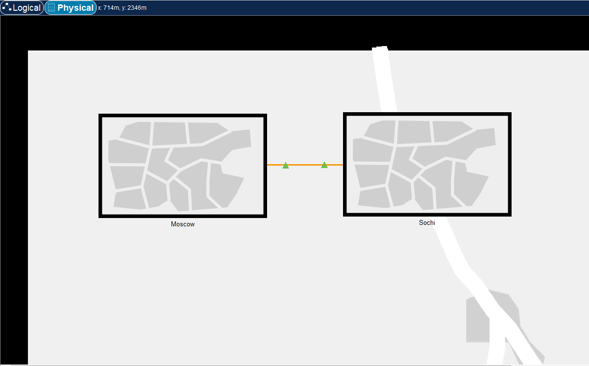{#fig:006 width=70%}

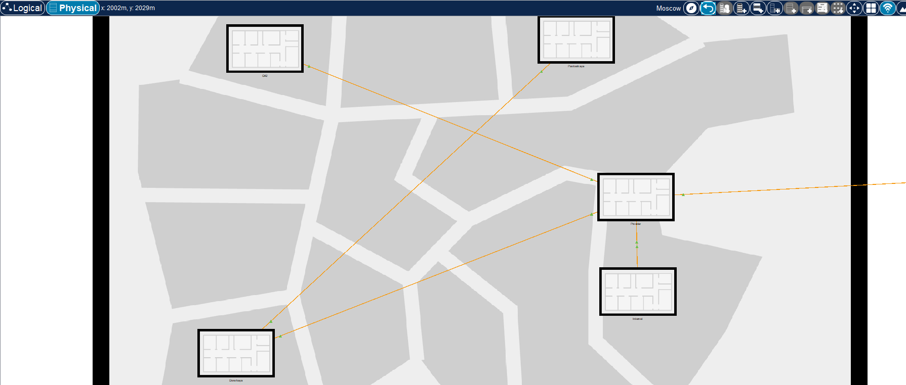{#fig:007 width=70%}

Перенесем из сети «Донская» оборудование сети 42-го квартала и сети
филиала в соответствующие здания(рис. [-@fig:008], [-@fig:009]).

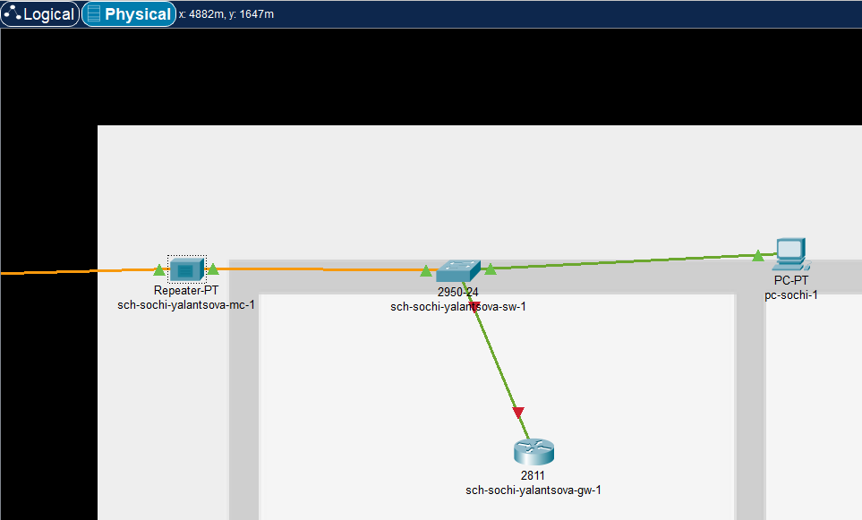{#fig:008 width=70%}

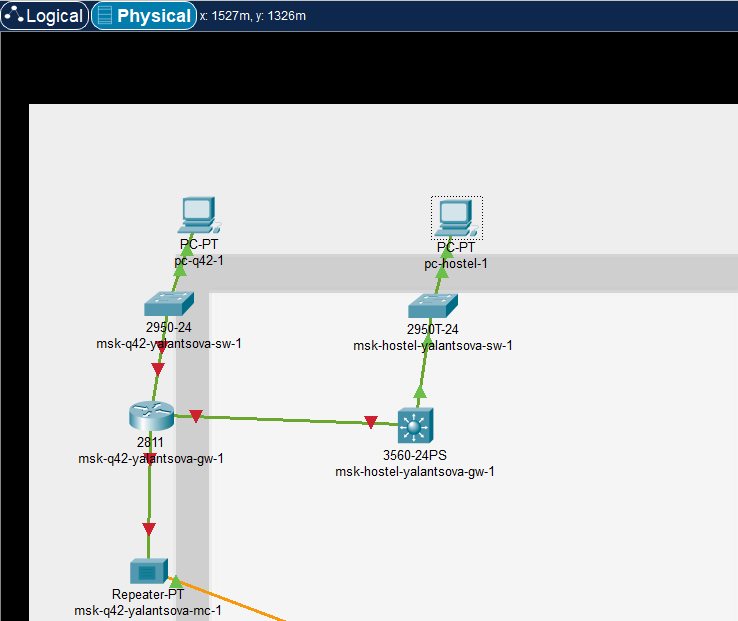{#fig:009 width=70%}

Затем соединим все объекты в соответствии со схемой L1 сети(рис. [-@fig:010]).

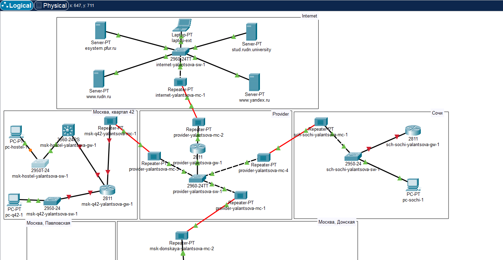{#fig:010 width=70%}

Перейдем к настройке оборудования. Для всех сетевых устройств установим имя хоста, доступ по паролю, telnet и ssh(рис. [-@fig:011] - [-@fig:016]).

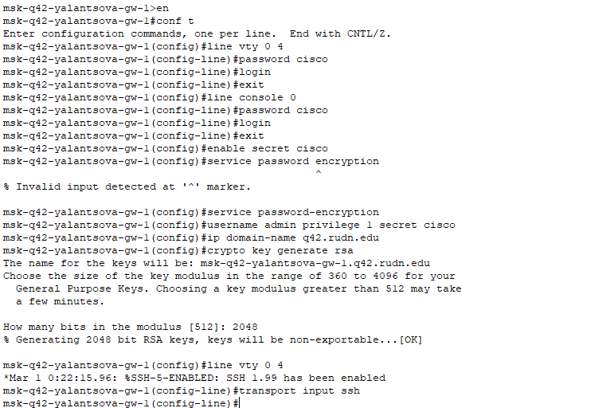{#fig:011 width=70%}

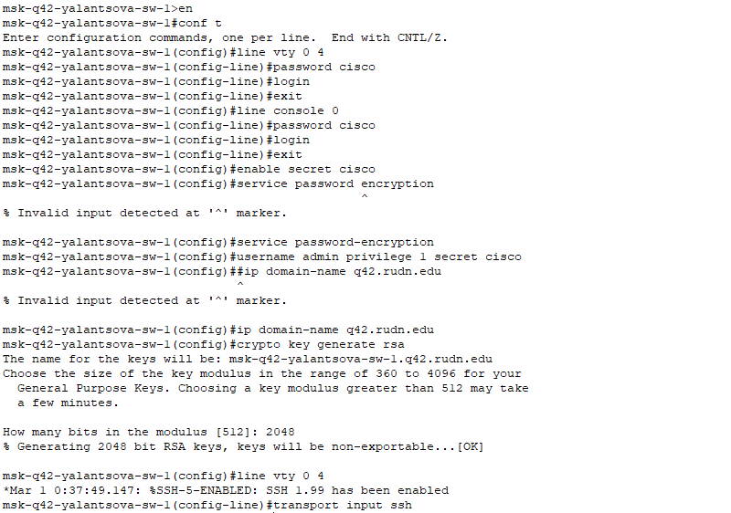{#fig:012 width=70%}

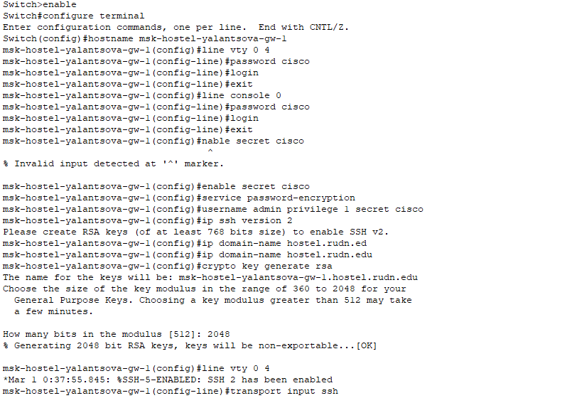{#fig:013 width=70%}

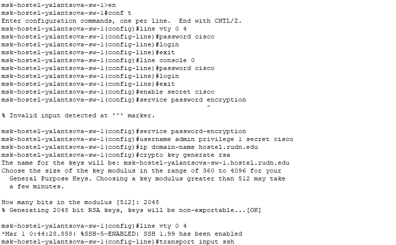{#fig:014 width=70%}

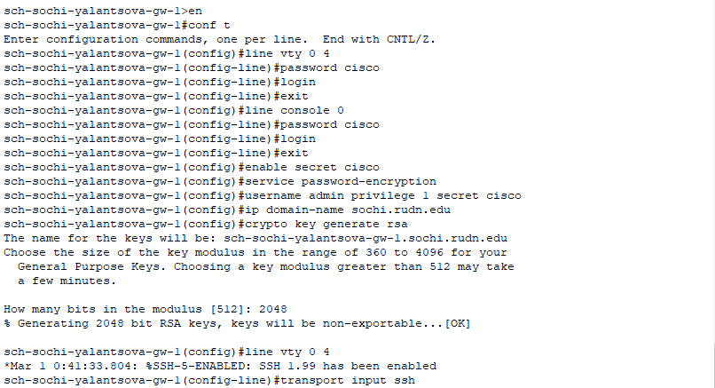{#fig:015 width=70%}

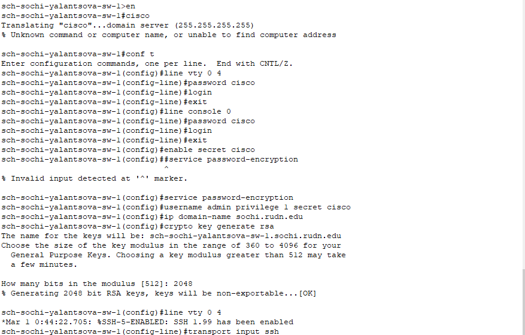{#fig:016 width=70%}

# Выводы

В результате выполнения лабораторной работы провели подготовительные мероприятия по организации взаимодействия через сеть провайдера посредством статической маршрутизации локальной сети с сетью основного здания, расположенного в 42-м квартале в Москве, и сетью филиала, расположенного в г. Сочи.

# Контрольные вопросы

1. В каких случаях следует использовать статическую маршрутизацию? При-
ведите примеры.
2. Укажите основные принципы статической маршрутизации между VLANs.

## 1. Случаи использования статической маршрутизации

Статическую маршрутизацию следует использовать в следующих случаях:

* **Для небольших сетей:** Когда сеть маленькая и не требует динамической маршрутизации.
* **Для резервных маршрутов:** Как резервный путь для динамической маршрутизации в случае сбоев.
* **Для контроля трафика:** Для направления трафика по конкретным путям, например, чтобы предотвратить перегрузку определенных ссылок.
* **Для администрирования сети:** Для ручного управления маршрутизацией для целей устранения неполадок или настройки.

**Примеры:**

* Настройка статического маршрута для подключения к удаленной офисной сети через VPN-соединение.
* Создание резервного маршрута на случай сбоя основного маршрутизатора.
* Направление трафика в определенный VLAN, чтобы отделить его от других видов трафика.
* Использование статической маршрутизации для перенаправления трафика на устройство межсетевого экрана для дополнительной безопасности.

## 2. Принципы статической маршрутизации между VLANs

Для статической маршрутизации между VLANs действуют следующие основные принципы:

* **Создание маршрута по умолчанию:** Необходимо создать маршрут по умолчанию для переадресации пакетов, не имеющих конкретного статического маршрута.
* **Указание адреса следующего перехода:** В каждом статическом маршруте должен быть указан адрес шлюза следующего перехода, через который должен проходить трафик.
* **Раздельное применение на разных VLANs:** Статические маршруты должны применяться отдельно к каждому VLAN, обеспечивая изоляцию трафика и контроль доступа.
* **Использование списков доступа (ACL):** ACL могут использоваться для управления тем, каким типам трафика разрешено проходить через статические маршруты.
* **Мониторинг и устранение неполадок:** Регулярно проверяйте статические маршруты, чтобы убедиться, что они работают должным образом, и устраняйте любые возникающие проблемы.
