---
## Front matter
lang: ru-RU
title: Лабораторная работа 14
subtitle: Статическая маршрутизация в Интернете. Настройка
author:
  - Ланцова Я. И.
institute:
  - Российский университет дружбы народов, Москва, Россия

## i18n babel
babel-lang: russian
babel-otherlangs: english

## Formatting pdf
toc: false
toc-title: Содержание
slide_level: 2
aspectratio: 169
section-titles: true
theme: metropolis
header-includes:
 - \metroset{progressbar=frametitle,sectionpage=progressbar,numbering=fraction}
 - \usepackage{fontspec}
 - \usepackage{polyglossia}
 - \setmainlanguage{russian}
 - \setotherlanguage{english}
 - \newfontfamily\cyrillicfont{Arial}
 - \newfontfamily\cyrillicfontsf{Arial}
 - \newfontfamily\cyrillicfonttt{Arial}
 - \setmainfont{Arial}
 - \setsansfont{Arial}
 
---

# Информация

## Докладчик

:::::::::::::: {.columns align=center}
::: {.column width="70%"}

  * Ланцова Яна Игоревна
  * студентка
  * Российский университет дружбы народов

:::
::::::::::::::

## Цель работы

Настроить взаимодействие через сеть провайдера посредством статической маршрутизации локальной сети организации с сетью основного здания, расположенного в 42-м квартале в Москве, и сетью филиала, расположенного в г. Сочи.

## Задание

1. Настроить связь между территориями.
2. Настроить оборудование, расположенное в квартале 42 в Москве.
3. Настроить оборудование, расположенное в филиале в г. Сочи.
4. Настроить статическую маршрутизацию между территориями.

## Задание

5. Настроить статическую маршрутизацию на территории квартала 42 в г.
Москве.
6. Настроить NAT на маршрутизаторе msk-donskaya-gw-1.
7. При выполнении работы необходимо учитывать соглашение об именовании.

# Выполнение лабораторной работы

# Настройка линка между площадками

## Выполнение лабораторной работы

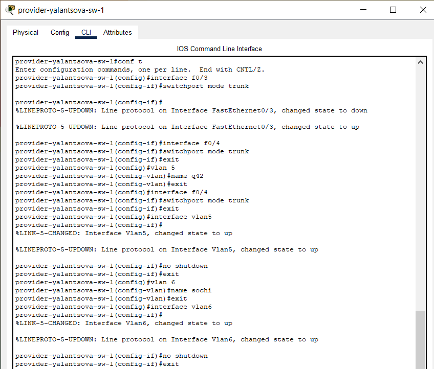{#fig:001 width=40%}

## Выполнение лабораторной работы

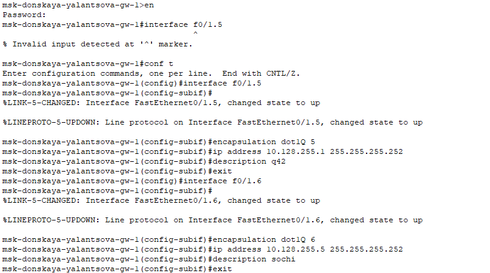{#fig:002 width=50%}

## Выполнение лабораторной работы

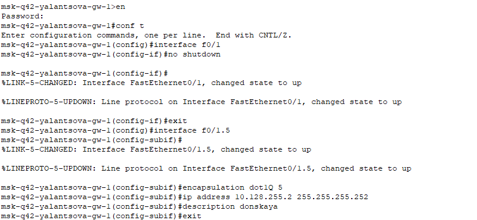{#fig:003 width=50%}

## Выполнение лабораторной работы

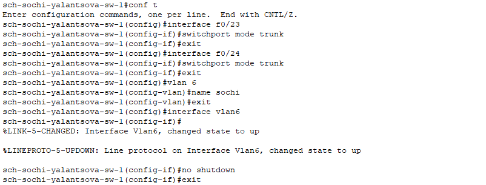{#fig:004 width=50%}

## Выполнение лабораторной работы

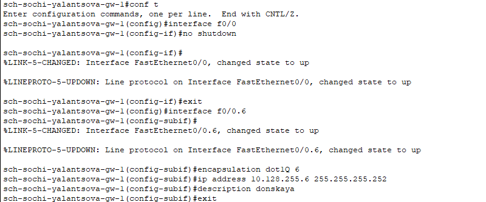{#fig:005 width=50%}

# Настройка площадки 42-го квартала

## Выполнение лабораторной работы

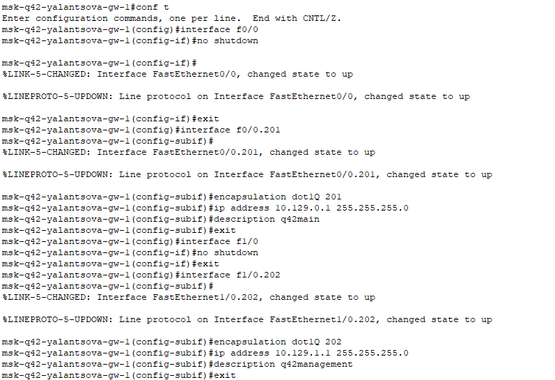{#fig:006 width=50%}

## Выполнение лабораторной работы

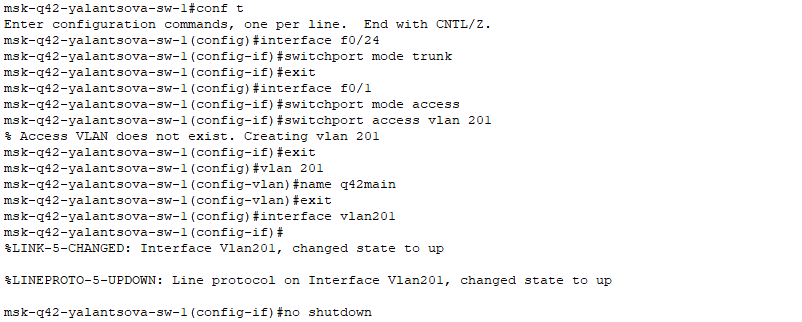{#fig:007 width=50%}

## Выполнение лабораторной работы

{#fig:008 width=40%}

## Выполнение лабораторной работы

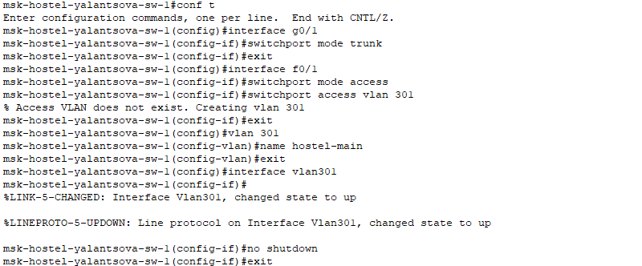{#fig:009 width=50%}

# Настройка площадки в Сочи

## Выполнение лабораторной работы

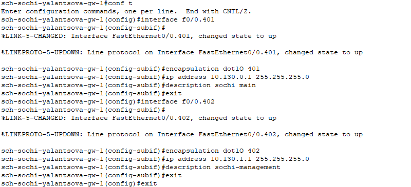{#fig:010 width=50%}

## Выполнение лабораторной работы

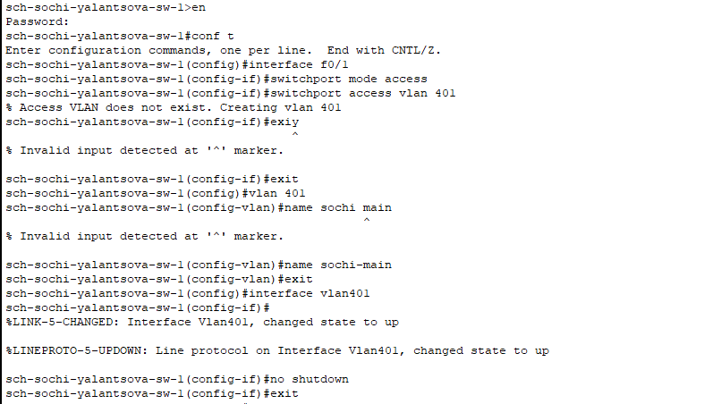{#fig:011 width=50%}

# Настройка маршрутизации между площадками

## Выполнение лабораторной работы

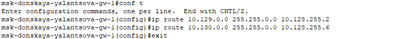{#fig:012 width=60%}

## Выполнение лабораторной работы

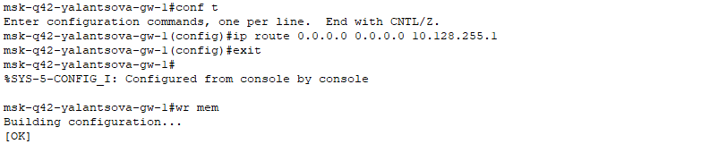{#fig:013 width=60%}

## Выполнение лабораторной работы

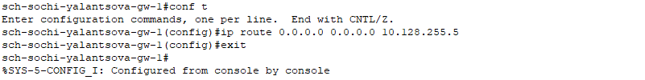{#fig:014 width=60%}

# Настройка маршрутизации на 42 квартале

## Выполнение лабораторной работы

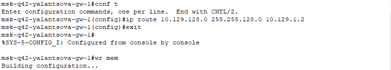{#fig:015 width=60%}

## Выполнение лабораторной работы

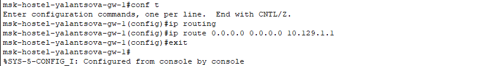{#fig:016 width=60%}

# Настройка NAT на маршрутизаторе msk-donskaya-gw-1

## Выполнение лабораторной работы

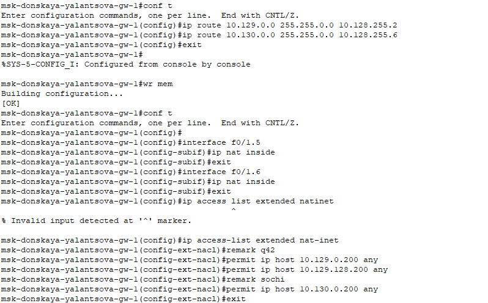{#fig:017 width=50%}

# Проверка настроек

## Выполнение лабораторной работы

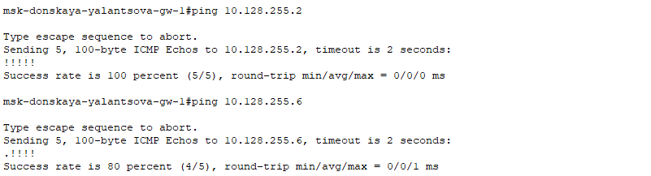{#fig:018 width=60%}

## Выполнение лабораторной работы

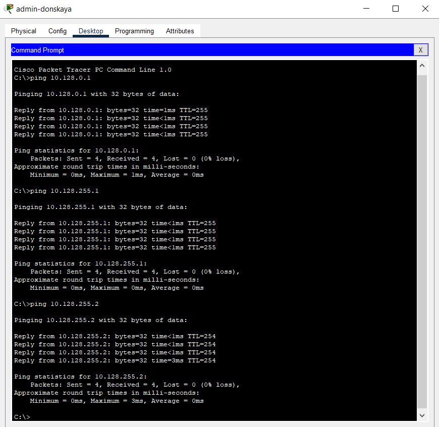{#fig:019 width=40%}

## Выполнение лабораторной работы

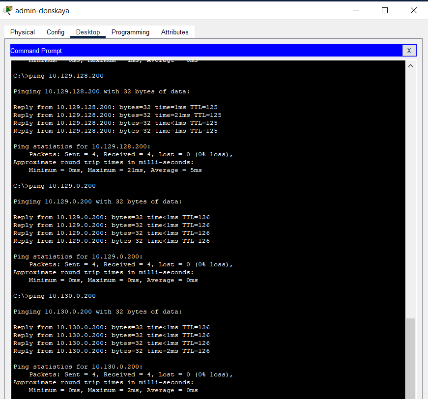{#fig:020 width=40%}

## Выполнение лабораторной работы

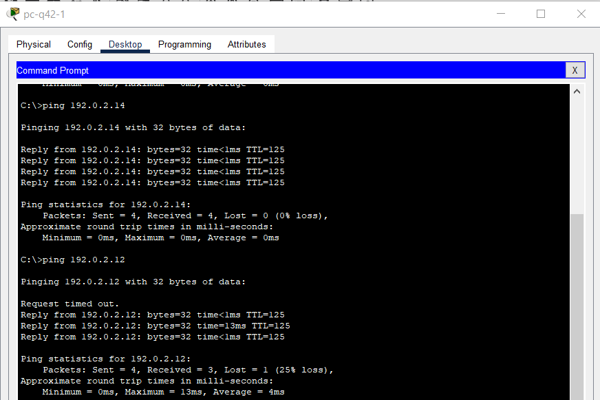{#fig:021 width=50%}

# Выводы

В результате выполнения лабораторной были приобретены практические навыки по настройке взаимодействие через сеть провайдера посредством статической маршрутизации локальной сети организации с сетью основного здания, расположенного в 42-м квартале в Москве, и сетью филиала, расположенного в г. Сочи.
