---
## Front matter
title: "Лабораторная работа 14"
subtitle: "Статическая маршрутизация в Интернете. Настройка"
author: "Ланцова Яна Игоревна"

## Generic otions
lang: ru-RU
toc-title: "Содержание"

## Bibliography
bibliography: bib/cite.bib
csl: pandoc/csl/gost-r-7-0-5-2008-numeric.csl

## Pdf output format
toc: true # Table of contents
toc-depth: 2
lof: true # List of figures
lot: true # List of tables
fontsize: 12pt
linestretch: 1.5
papersize: a4
documentclass: scrreprt
## I18n polyglossia
polyglossia-lang:
  name: russian
  options:
    - spelling=modern
    - babelshorthands=true
polyglossia-otherlangs:
  name: english
## I18n babel
babel-lang: russian
babel-otherlangs: english
## Fonts
mainfont: IBM Plex Serif
romanfont: IBM Plex Serif
sansfont: IBM Plex Sans
monofont: IBM Plex Mono
mathfont: STIX Two Math
mainfontoptions: Ligatures=Common,Ligatures=TeX,Scale=0.94
romanfontoptions: Ligatures=Common,Ligatures=TeX,Scale=0.94
sansfontoptions: Ligatures=Common,Ligatures=TeX,Scale=MatchLowercase,Scale=0.94
monofontoptions: Scale=MatchLowercase,Scale=0.94,FakeStretch=0.9
mathfontoptions:
## Biblatex
biblatex: true
biblio-style: "gost-numeric"
biblatexoptions:
  - parentracker=true
  - backend=biber
  - hyperref=auto
  - language=auto
  - autolang=other*
  - citestyle=gost-numeric
## Pandoc-crossref LaTeX customization
figureTitle: "Рис."
tableTitle: "Таблица"
listingTitle: "Листинг"
lofTitle: "Список иллюстраций"
lotTitle: "Список таблиц"
lolTitle: "Листинги"
## Misc options
indent: true
header-includes:
  - \usepackage{indentfirst}
  - \usepackage{float} # keep figures where there are in the text
  - \floatplacement{figure}{H} # keep figures where there are in the text
---

# Цель работы

Настроить взаимодействие через сеть провайдера посредством статической маршрутизации локальной сети организации с сетью основного здания, расположенного в 42-м квартале в Москве, и сетью филиала, расположенного в г. Сочи.

# Задание

1. Настроить связь между территориями.
2. Настроить оборудование, расположенное в квартале 42 в Москве.
3. Настроить оборудование, расположенное в филиале в г. Сочи.
4. Настроить статическую маршрутизацию между территориями.
5. Настроить статическую маршрутизацию на территории квартала 42 в г.
Москве.
6. Настроить NAT на маршрутизаторе msk-donskaya-gw-1.
7. При выполнении работы необходимо учитывать соглашение об именовании.

# Выполнение лабораторной работы

## Настройка линка между площадками

Проведем настройку интерфейсов коммутатора provider-yalantsova-sw-1: поднимем и сделаем транковыми интерфейсы f0/3 и f0/4, к которым подключены репитеры для связи с коммутаторами на двух новых территориях, также зададим 5 и 6 VLAN, через которые происходит связь(рис. [-@fig:001]).

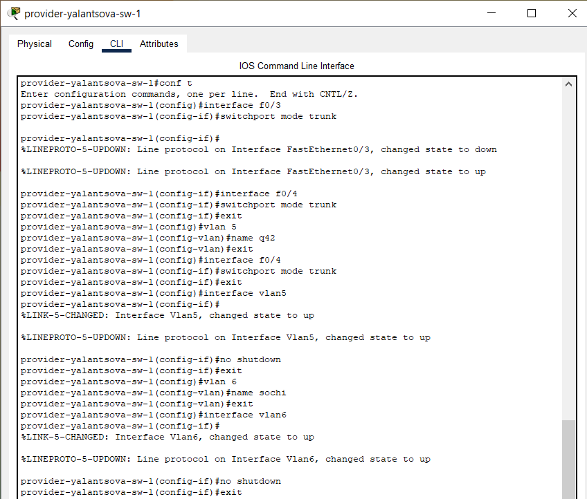{#fig:001 width=70%}

Затем на маршрутизаторе с территории Донская создадим субинтерфейсы f0/1.5 и f0/1.6 для 5 и 6 VLAN, также зададим ip-адрес маршрутизатора в этих VLAN(рис. [-@fig:002]):

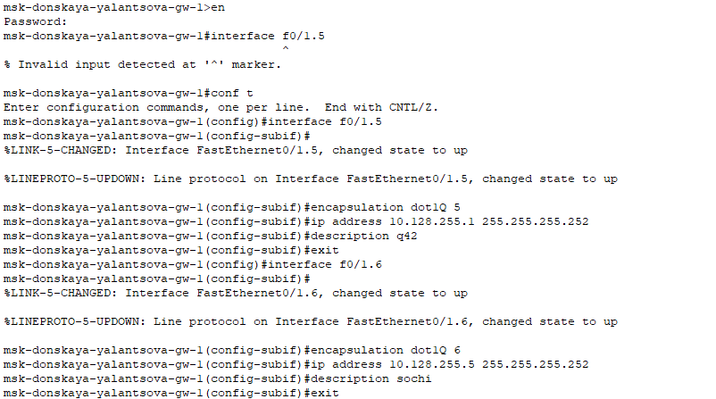{#fig:002 width=70%}

Настроим интерфейсы маршрутизатора msk-q42-yalantsova-gw-1: поднимем интерфейс f0/1, создадим субинтерфейс f0/1.5 для 5 vlan и зададим ip-адрес(рис. [-@fig:003]).

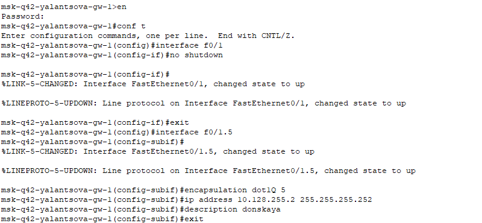{#fig:003 width=70%}

Настроим интерфейсы коммутатора sch-sochi-yalantsova-sw-1: сделаем транковыми порты f0/23  и f0/24, зададим 6 vlan с именем sochi(рис. [-@fig:004]).

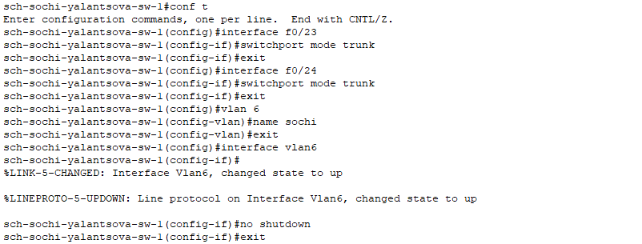{#fig:004 width=70%}

Настроим интерфейсы маршрутизатора sch-sochi-yalantsova-gw-1: поднимем интерфейс f0/0, создадим интерфейс f0/0.6 для 6 vlan и зададим ip-адрес(рис. [-@fig:005]):

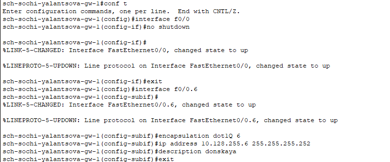{#fig:005 width=90%}

## Настройка площадки 42-го квартала

Настроим интерфейсы маршрутизатора msk-q42-yalantsova-gw-1: поднимем интерфейс f0/0, создадим субинтерфейс f0/0.201 для 201 vlan(основной на этой территории) и зададим ip-адрес, создадим субинтерфейс f0/0.202 для 202 vlan(для управления устройствами территории) и зададим ip-адрес(рис. [-@fig:006]).

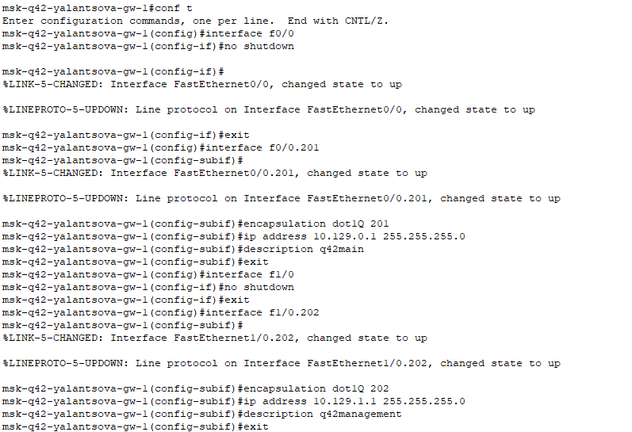{#fig:006 width=70%}

Настроим интерфейсы коммутатора msk-q42-yalantsova-sw-1: сделаем транковым интерфейс f0/24, зададим оконечному устройству по f0/1 доступ к 201 vlan(рис. [-@fig:007]).

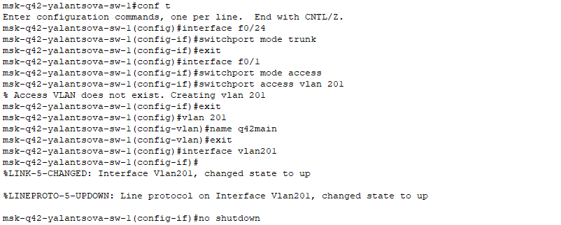{#fig:007 width=70%}

Настроим интерфейсы маршрутизирующего коммутатора msk-hostel-yalantsova-gw-1: сделаем транковыми интерфейсы g0/1 и f0/1, создадим 202 и 301(для общежитий) vlan(рис. [-@fig:008]).

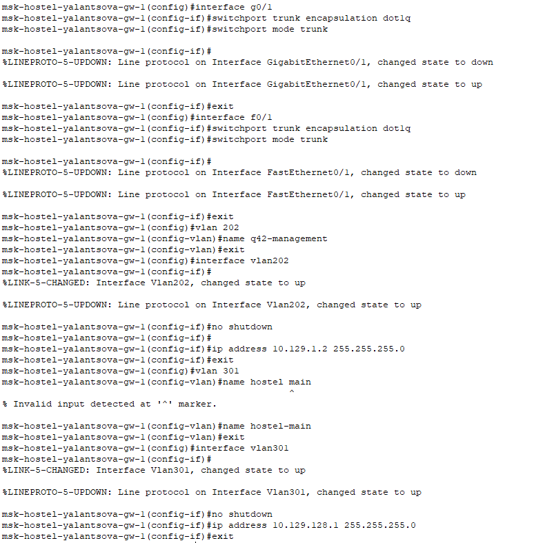{#fig:008 width=70%}

Настроим интерфейсы коммутатора msk-hostel-yalantsova-sw-1: сделаем транковым интерфейс g0/1, по f0/1 дадим доступ к 301 vlan(рис. [-@fig:009]):

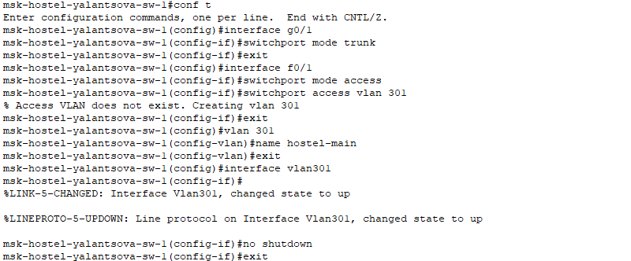{#fig:009 width=90%}

## Настройка площадки в Сочи

Настроим интерфейсы маршрутизатора sch-sochi-yalantsova-gw-1: создадим субинтерфейс f0/0.401 для 401 vlan(основной на этой территории) и зададим ip-адрес, создадим субинтерфейс f0/0.402 для 402 vlan(для управления устройствами территории) и зададим ip-адрес(рис. [-@fig:010]):

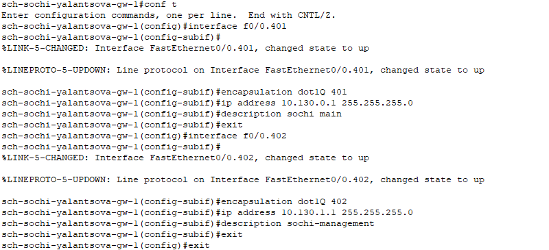{#fig:010 width=70%}

Настроим интерфейсы коммутатора sch-sochi-yalantsova-sw-1: зададим vlan 401 и оконечному устройству по f0/1 доступ к нему(рис. [-@fig:011]):

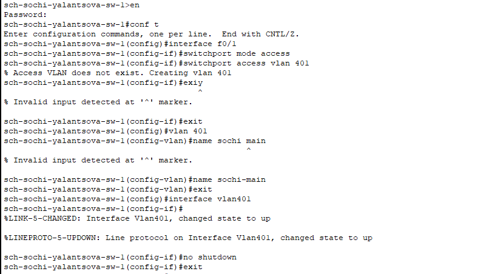{#fig:011 width=70%}

## Настройка маршрутизации между площадками

Зададим маршруты по умолчанию для маршрутизатора на Донской - на марщрутизаторы в Сочи и в 42 квартале, а также в обратную сторону(рис. [-@fig:012] - [-@fig:014]).

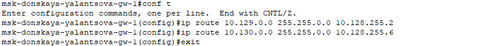{#fig:012 width=70%}

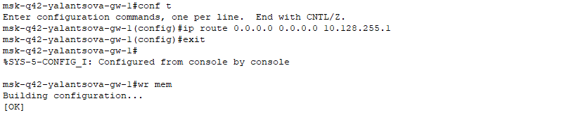{#fig:013 width=70%}

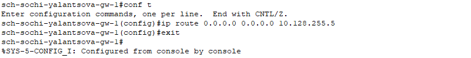{#fig:014 width=70%}

## Настройка маршрутизации на 42 квартале

Настроим маршруты между маршрутизаторами на 42 квартале(рис. [-@fig:015], [-@fig:016]).

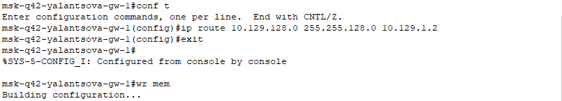{#fig:015 width=70%}

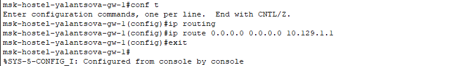{#fig:016 width=70%}

## Настройка NAT на маршрутизаторе msk-donskaya-gw-1

Настроим NAT на маршрутизаторе msk-donskaya-gw-1, дополним список доступа к интернет-ресурсам, разрещив оконечным устройствам с обеих территорий доступ ко всему(рис. [-@fig:017]):

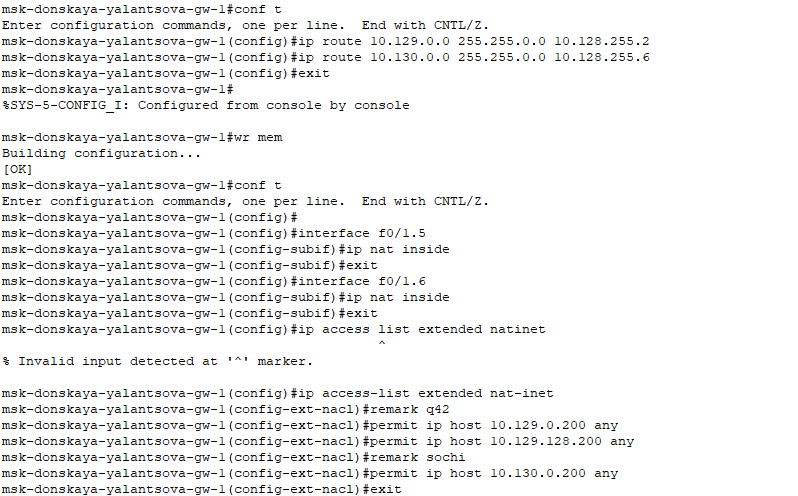{#fig:017 width=70%}

## Проверка настроек

Проверим связь между маршрутизаторами(рис. [-@fig:018]):

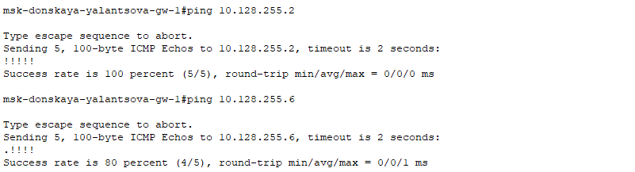{#fig:018 width=70%}

Проверим связь между администратором с Донской и маршрутизаторами на 42 квартале и в Сочи(рис. [-@fig:019]):

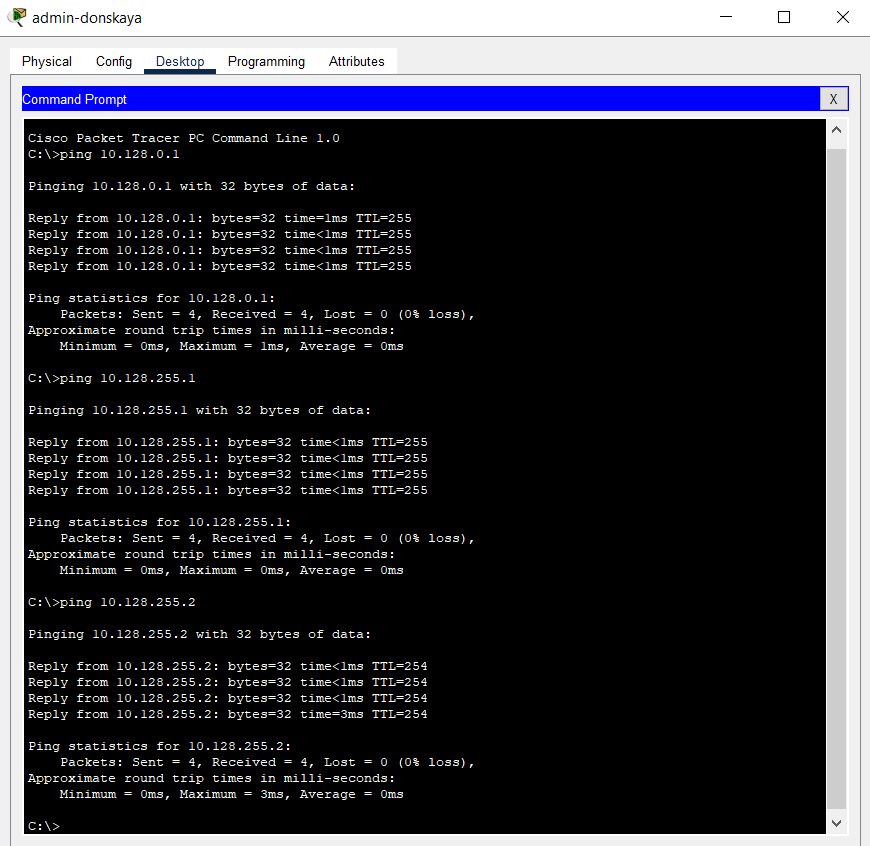{#fig:019 width=70%}

Проверим связь между администратором с Донской и оконечными устройствами на 42 квартале и в Сочи(рис. [-@fig:020]):

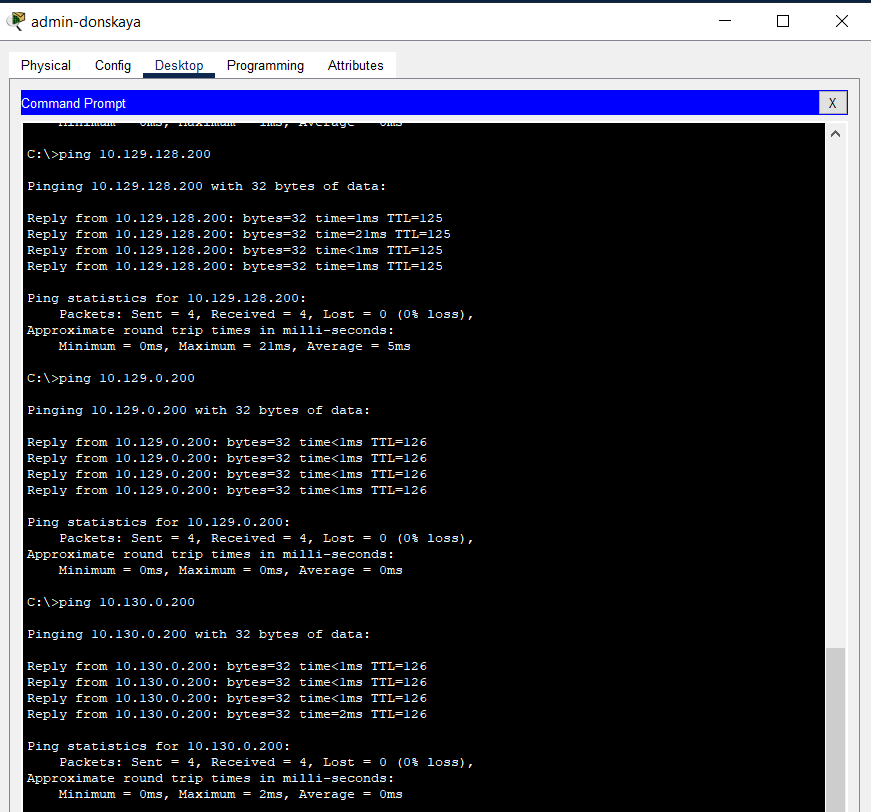{#fig:020 width=70%}

Проверим доступ в Интернет с оконечных устройств на новых территориях(рис. [-@fig:021]):

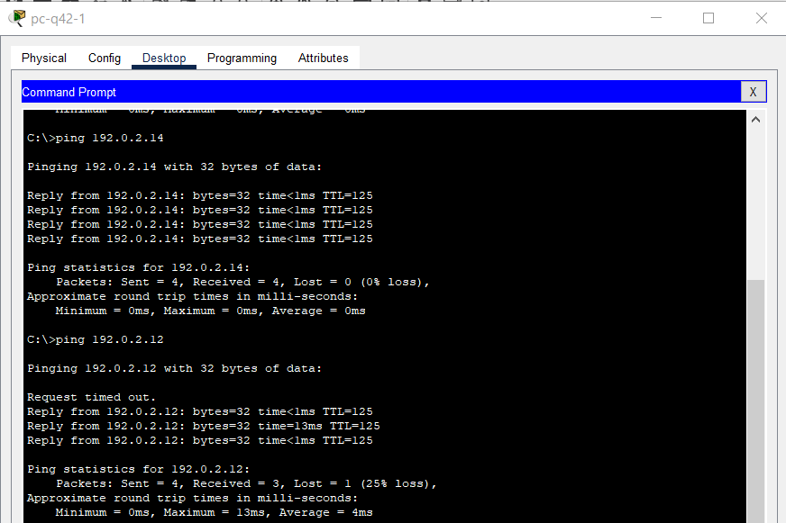{#fig:021 width=70%}

# Выводы

В результате выполнения лабораторной были приобретены практические навыки по настройке взаимодействие через сеть провайдера посредством статической маршрутизации локальной сети организации с сетью основного здания, расположенного в 42-м квартале в Москве, и сетью филиала, расположенного в г. Сочи.

# Контрольные вопросы

1. Приведите пример настройки статической маршрутизации между двумя подсетями организации.
2. Опишите процесс обращения устройства из одного VLAN к устройству из другого VLAN.
3. Как проверить работоспособность маршрута?
4. Как посмотреть таблицу маршрутизации?

1. Настройка статической маршрутизации между двумя подсетями организации

```
R1(config)# ip route 192.168.2.0 255.255.255.0 192.168.1.2
R2(config)# ip route 192.168.1.0 255.255.255.0 192.168.2.1
```

2. Процесс обращения устройства из одного VLAN к устройству из другого VLAN

- Трафик из VLAN 1 попадает на коммутатор доступа 1.
- Коммутатор доступа 1 отправляет трафик на маршрутизатор R1 по транковому соединению.
- R1 применяет статический маршрут к подсети 192.168.2.0 и пересылает трафик на R2.
- R2 пересылает трафик на коммутатор доступа 2 по транковому соединению.
- Коммутатор доступа 2 пересылает трафик устройству во VLAN 2.

3. Как проверить работоспособность маршрута**

- Использовать команду `ping`: `ping 192.168.2.10`
- Использовать команду `traceroute`: `traceroute 192.168.2.10`

4. Как посмотреть таблицу маршрутизации

- Использовать команду `show ip route`
