---
## Front matter
title: "Лабораторная работа 15"
subtitle: "Динамическая маршрутизация"
author: "Ланцова Яна Игоревна"

## Generic otions
lang: ru-RU
toc-title: "Содержание"

## Bibliography
bibliography: bib/cite.bib
csl: pandoc/csl/gost-r-7-0-5-2008-numeric.csl

## Pdf output format
toc: true # Table of contents
toc-depth: 2
lof: true # List of figures
lot: true # List of tables
fontsize: 12pt
linestretch: 1.5
papersize: a4
documentclass: scrreprt
## I18n polyglossia
polyglossia-lang:
  name: russian
  options:
    - spelling=modern
    - babelshorthands=true
polyglossia-otherlangs:
  name: english
## I18n babel
babel-lang: russian
babel-otherlangs: english
## Fonts
mainfont: IBM Plex Serif
romanfont: IBM Plex Serif
sansfont: IBM Plex Sans
monofont: IBM Plex Mono
mathfont: STIX Two Math
mainfontoptions: Ligatures=Common,Ligatures=TeX,Scale=0.94
romanfontoptions: Ligatures=Common,Ligatures=TeX,Scale=0.94
sansfontoptions: Ligatures=Common,Ligatures=TeX,Scale=MatchLowercase,Scale=0.94
monofontoptions: Scale=MatchLowercase,Scale=0.94,FakeStretch=0.9
mathfontoptions:
## Biblatex
biblatex: true
biblio-style: "gost-numeric"
biblatexoptions:
  - parentracker=true
  - backend=biber
  - hyperref=auto
  - language=auto
  - autolang=other*
  - citestyle=gost-numeric
## Pandoc-crossref LaTeX customization
figureTitle: "Рис."
tableTitle: "Таблица"
listingTitle: "Листинг"
lofTitle: "Список иллюстраций"
lotTitle: "Список таблиц"
lolTitle: "Листинги"
## Misc options
indent: true
header-includes:
  - \usepackage{indentfirst}
  - \usepackage{float} # keep figures where there are in the text
  - \floatplacement{figure}{H} # keep figures where there are in the text
---

# Цель работы

Настроить динамическую маршрутизацию между территориями организации.

# Задание

1. Настроить динамическую маршрутизацию по протоколу OSPF на маршрутизаторах msk-donskaya-gw-1, msk-q42-gw-1, msk-hostel-gw-1, sch-sochi-gw-1.
2. Настроить связь сети квартала 42 в Москве с сетью филиала в г. Сочи напрямую.
3. В режиме симуляции отследить движение пакета ICMP с ноутбука администратора сети на Донской в Москве (Laptop-PT admin) до компьютера пользователя в филиале в г. Сочи pc-sochi-1.
4. На коммутаторе провайдера отключить временно vlan 6 и в режиме симуляции убедиться в изменении маршрута прохождения пакета ICMP с ноутбука администратора сети на Донской в Москве (Laptop-PT admin) до компьютера пользователя в филиале в г. Сочи pc-sochi-1.
5. На коммутаторе провайдера восстановить vlan 6 и в режиме симуляции убедиться в изменении маршрута прохождения пакета ICMP с ноутбука администратора сети на Донской в Москве (Laptop-PT admin) до компьютера пользователя в филиале в г. Сочи pc-sochi-1.

# Выполнение лабораторной работы

## Настройка OSPF

Включим OSPF на маршрутизаторах: включим процесс OSPF командой `router ospf <process-id>`, и назначим области (зоны) интерфейсам с помощью команды
`network <network or IP address> <mask> area <area-id>`.

Сначала включим на маршрутизаторе msk-donskaya-gw-1(рис. [-@fig:001]).

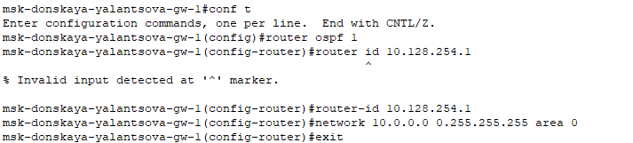{#fig:001 width=70%}

И посмотрим состояние протокола: общую информацию об OSPF, соседей маршрутизатора(на этом тапе их нет, так как это единственный маршрутизатор с этим протоколом) и таблицу маршрутизации(рис. [-@fig:002]):

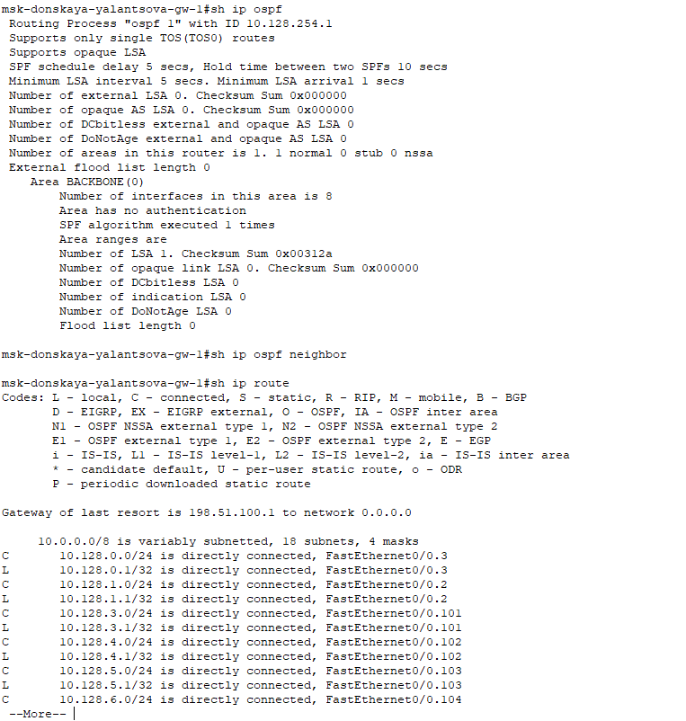{#fig:002 width=70%}

Затем включим OSPF на остальных маршрутизаторах(рис. [-@fig:003] - [-@fig:005])

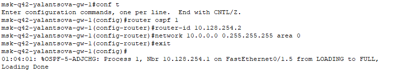{#fig:003 width=70%}

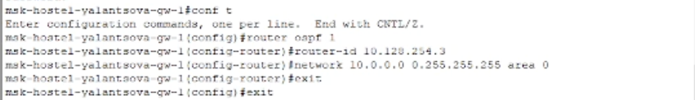{#fig:004 width=70%}

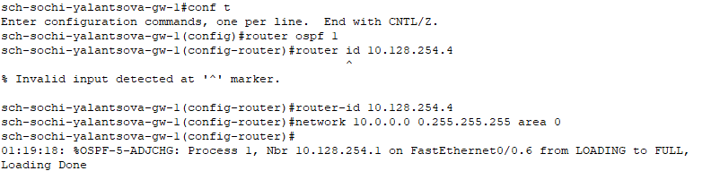{#fig:005 width=70%}

Проверим состояние протокола OSPF на всех маршрутизаторах. У msk-hostel-gw-1 один сосед -- msk-q42-gw-1, так как связь с другими территориями возможна только через него. В таблице маршрутизации указана связь через msk-q42-gw-1(ip-адрес подсети 42 квартала)(рис. [-@fig:006]):

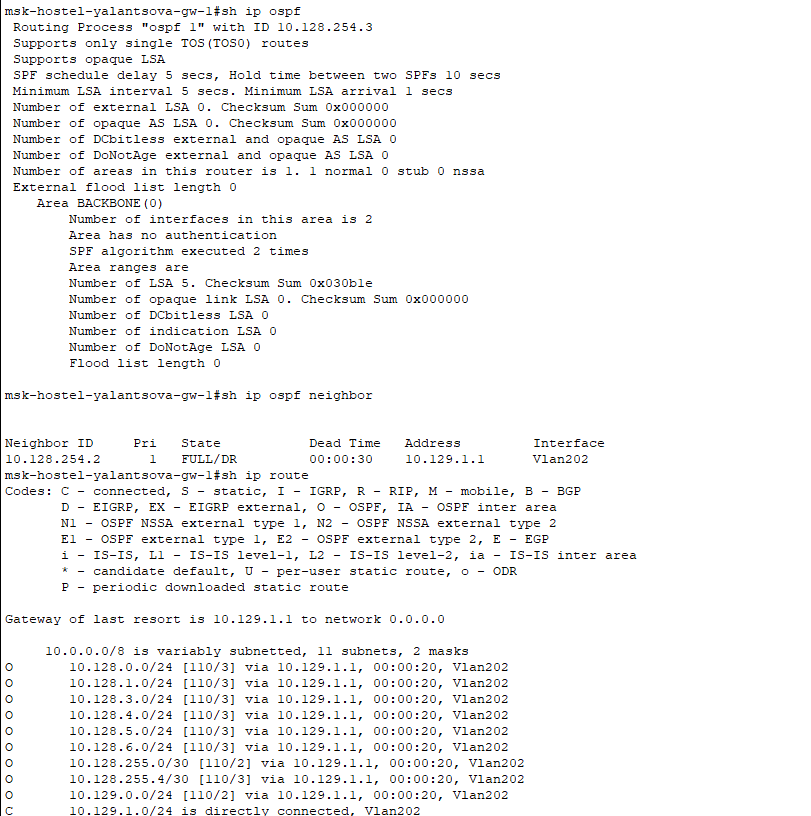{#fig:006 width=70%}

У sch-sochi-gw-1 один сосед -- msk-donskaya-gw-1, так как пока что не настроена прямая связь между территориями Сочи и 42 квартал. Это также отражено в таблице маршрутизации -- указано, что пакеты не только на устройства на Донской идут через  msk-donskaya-gw-1(адрес из подсети линка в Сочи), но и в 42 квартал(рис. [-@fig:007]).

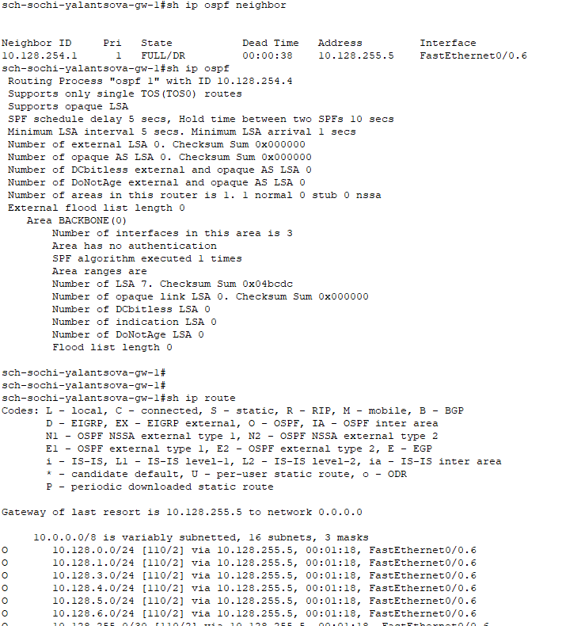{#fig:007 width=70%}

У msk-q42-gw-1 сосед msk-donskaya-gw-1 и msk-hostel-gw-1, так как пока что не настроена прямая связь между территориями Сочи и 42 квартал (извините, этот скрин делала после выполнения лабораторной работы, поэтому есть еще и Сочи, но его не должно быть пока). К оконечным устройствам общежития пакеты идут через msk-hostel-gw-1(рис. [-@fig:008]).

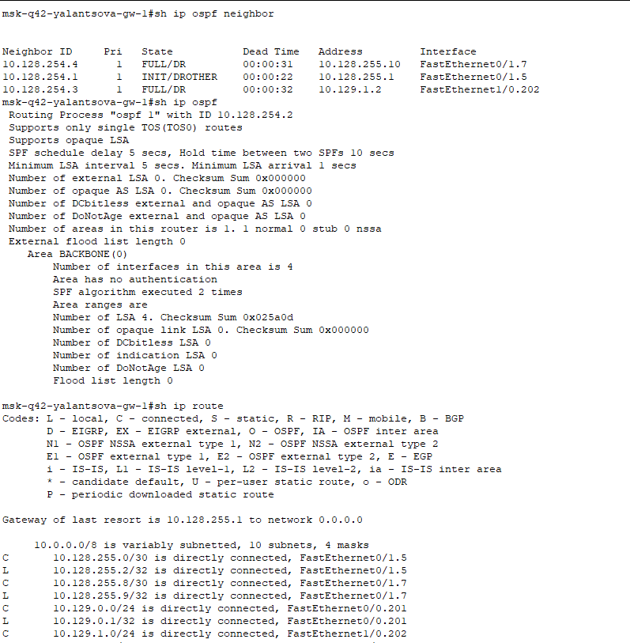{#fig:008 width=70%}

## Настройка линка 42-й квартал–Сочи

Настроим маршруты между маршрутизаторами на 42 квартале, добавив 7 vlan для их коммуникации на коммутаторе с территории провайдера(так как через него будут идти пакеты) и на маршрутизаторе в Сочи, коммутаторе в Сочи и маршрутизаторе в 42 квартале(рис. [-@fig:009] - [-@fig:012]).

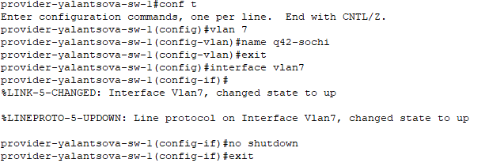{#fig:009 width=70%}

{#fig:010 width=70%}

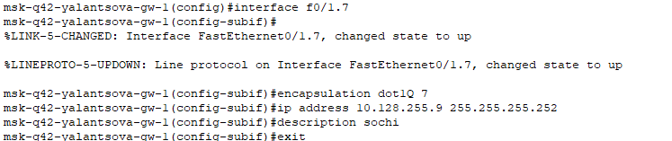{#fig:011 width=70%}

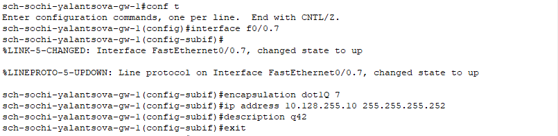{#fig:012 width=70%}

## Проверка настроек

В режиме симуляции проследим за движением ICMP-пакета при пересылке с администратора на ПК в Сочи: он идёт через коммутатор на Донской и коммутатор в Сочи(рис. [-@fig:013]).

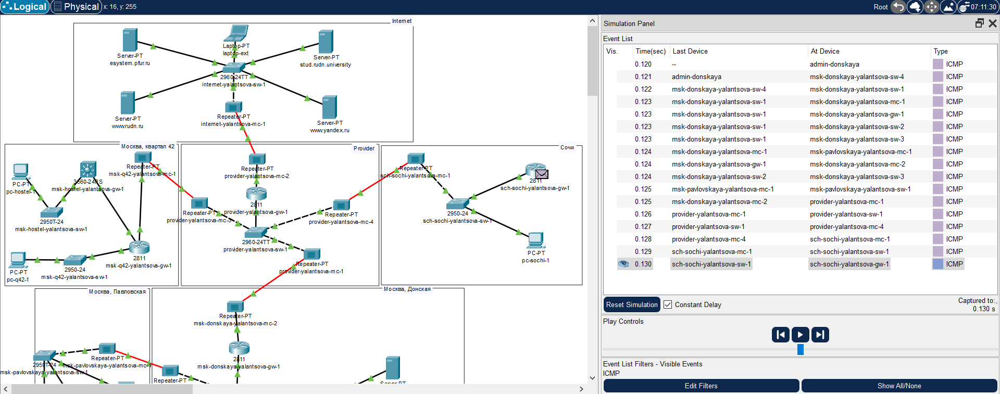{#fig:013 width=70%}

Это также можно посмотреть с помощью команды tracert(рис. [-@fig:014]):

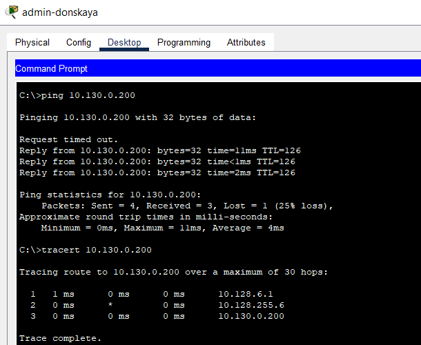{#fig:014 width=70%}

При отключении 6 vlan(линк в Сочи) можно увидеть, что теперь пакету, чтобы узнать маршрут необходимо дойти до маршрутизатора на 42 квартале, после чего пакет идёт через коммутатор провайдера по связи настроенной ранее через 7 vlan(рис. [-@fig:015]):

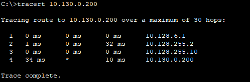{#fig:015 width=70%}

При включении 6 vlan маршрут снова перестраивается на кратчайший.

# Выводы

В результате выполнения лабораторной были приобретены практические навыки по настройке динамической маршрутизации между территориями организации.

# Контрольные вопросы

1. Какие протоколы относятся к протоколам динамической маршрутизации?
2. Охарактеризуйте принципы работы протоколов динамической маршрутизации.
3. Опишите процесс обращения устройства из одной подсети к устройству из другой подсети по протоколу динамической маршрутизации.
4. Опишите выводимую информацию при просмотре таблицы маршрутизации.

1. Протоколы динамической маршрутизации

* RIP (Routing Information Protocol)
* OSPF (Open Shortest Path First)
* EIGRP (Enhanced Interior Gateway Routing Protocol)
* IS-IS (Intermediate System to Intermediate System)
* BGP (Border Gateway Protocol)

2. Принципы работы протоколов динамической маршрутизации

Эти протоколы используют обмен сообщениями между маршрутизаторами для сбора и обмена информацией о доступных маршрутах. Они динамически обновляют свои таблицы маршрутизации, основываясь на этом обмене, что позволяет им приспосабливаться к изменениям в сети.

3. Обращение устройства к устройству из другой подсети

Когда устройство из одной подсети пытается связаться с устройством из другой подсети:

- Исходный маршрутизатор проверяет свою таблицу маршрутизации на наличие маршрута к целевому адресу назначения.
- Если маршрут найден, маршрутизатор отправляет сообщение по этому маршруту.
- Если маршрут не найден, маршрутизатор использует протокол динамической маршрутизации для запроса и получения маршрута к целевому адресу назначения.
- После получения маршрута маршрутизатор обновляет свою таблицу маршрутизации и отправляет сообщение по полученному маршруту.

4. Информация в таблице маршрутизации

При просмотре таблицы маршрутизации отображается следующая информация:

- **Целевой адрес назначения:** Адрес назначения маршрута.
- **Маска подсети:** Маска подсети, используемая для определения назначения.
- **Следующий переход:** Адрес следующего маршрутизатора, к которому следует отправлять пакеты для достижения целевого адреса назначения.
- **Интерфейс:** Интерфейс, используемый для отправки пакетов на следующий переход.
- **Метрика:** Значение, используемое для измерения стоимости маршрута.
- **Административное расстояние:** Значение, определяющее предпочтение маршрута.

