---
## Front matter
title: "Лабораторная работа 16"
subtitle: "Настройка VPN"
author: "Ланцова Яна Игоревна"

## Generic otions
lang: ru-RU
toc-title: "Содержание"

## Bibliography
bibliography: bib/cite.bib
csl: pandoc/csl/gost-r-7-0-5-2008-numeric.csl

## Pdf output format
toc: true # Table of contents
toc-depth: 2
lof: true # List of figures
lot: true # List of tables
fontsize: 12pt
linestretch: 1.5
papersize: a4
documentclass: scrreprt
## I18n polyglossia
polyglossia-lang:
  name: russian
  options:
    - spelling=modern
    - babelshorthands=true
polyglossia-otherlangs:
  name: english
## I18n babel
babel-lang: russian
babel-otherlangs: english
## Fonts
mainfont: IBM Plex Serif
romanfont: IBM Plex Serif
sansfont: IBM Plex Sans
monofont: IBM Plex Mono
mathfont: STIX Two Math
mainfontoptions: Ligatures=Common,Ligatures=TeX,Scale=0.94
romanfontoptions: Ligatures=Common,Ligatures=TeX,Scale=0.94
sansfontoptions: Ligatures=Common,Ligatures=TeX,Scale=MatchLowercase,Scale=0.94
monofontoptions: Scale=MatchLowercase,Scale=0.94,FakeStretch=0.9
mathfontoptions:
## Biblatex
biblatex: true
biblio-style: "gost-numeric"
biblatexoptions:
  - parentracker=true
  - backend=biber
  - hyperref=auto
  - language=auto
  - autolang=other*
  - citestyle=gost-numeric
## Pandoc-crossref LaTeX customization
figureTitle: "Рис."
tableTitle: "Таблица"
listingTitle: "Листинг"
lofTitle: "Список иллюстраций"
lotTitle: "Список таблиц"
lolTitle: "Листинги"
## Misc options
indent: true
header-includes:
  - \usepackage{indentfirst}
  - \usepackage{float} # keep figures where there are in the text
  - \floatplacement{figure}{H} # keep figures where there are in the text
---

# Цель работы

Получение навыков настройки VPN-туннеля через незащищённое Интернет-соединение.

# Задание

Настроить VPN-туннель между сетью Университета г. Пиза (Италия) и сетью «Донская» в г. Москваs

# Выполнение лабораторной работы

## Размещение оборудования

Разместим в рабочей области проекта оборудование для сети Университета г. Пиза.(рис. [-@fig:001]).

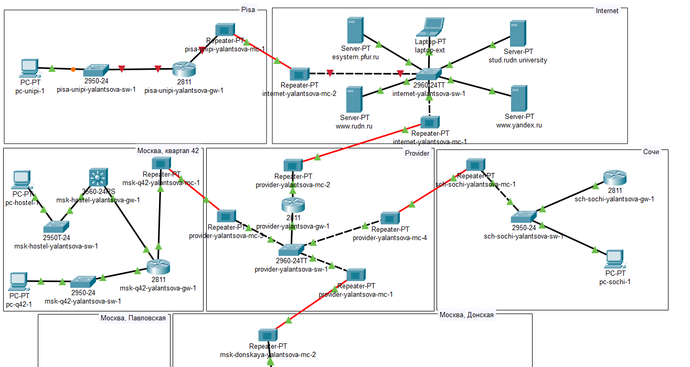{#fig:001 width=70%}

В физической рабочей области проекта создадим город Пиза, здание Универ-
ситета г. Пиза. Переместим туда соответствующее оборудование.(рис. [-@fig:002], [-@fig:003]):

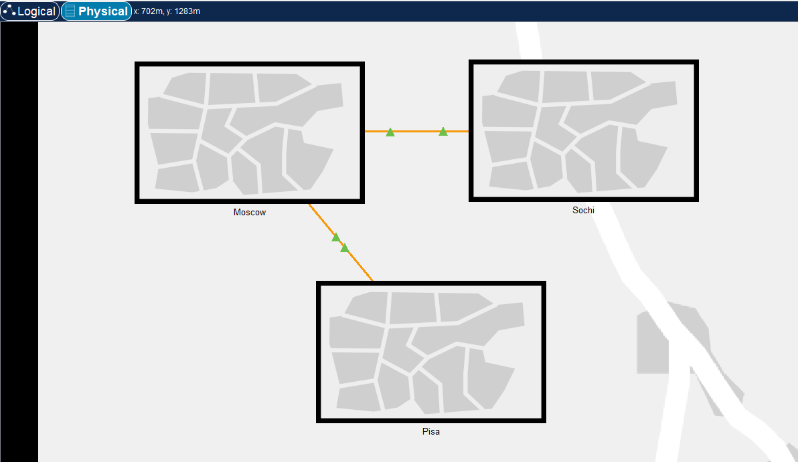{#fig:002 width=70%}

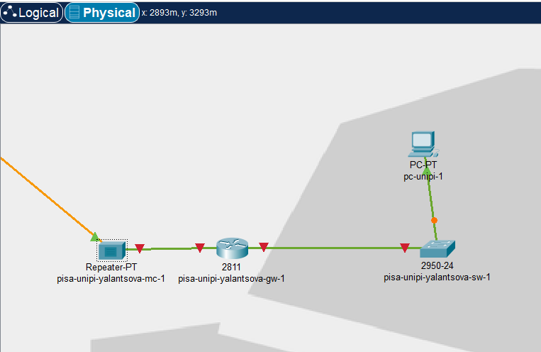{#fig:003 width=70%}

## Первоначальная настройка оборудования

Для коммутатора и маршрутизатора на территории города Пиза установим имя хоста, доступ по паролю, telnet и ssh(рис. [-@fig:004], [-@fig:005]).

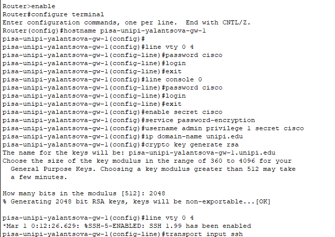{#fig:004 width=70%}

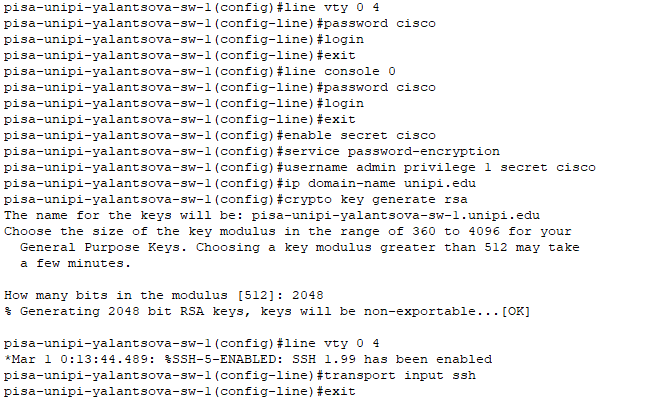{#fig:005 width=70%}

Теперь настроим интерфейсы на сетевых устройтсвах Пизы(рис. [-@fig:006], [-@fig:007]). Для машрутизатора поднимем интерфейс f0/0, а на нем субинтерфейс f0/0.401 для основного 401 vlan Пизы, и зададим ip-адрес. Также поднимем f0/1 и зададим ip-адрес для связи с подсетью Интернет, указав маршрут по умолчанию к маршрутизатору из сети Интернет. На коммутаторе поднимем интерфейс f0/24 и сделаем его транковым, а на интерфейсе f0/1 дадим доступ к vlan 401 Пизы.

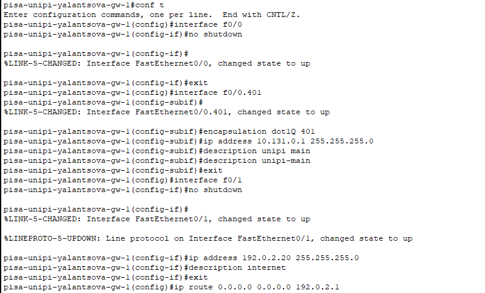{#fig:006 width=70%}

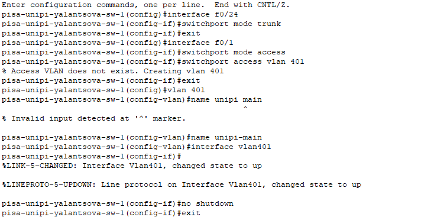{#fig:007 width=70%}

Проверим связь устройств внутри Пизы, пропинговав марщрутизатор с ПК(рис. [-@fig:008]).

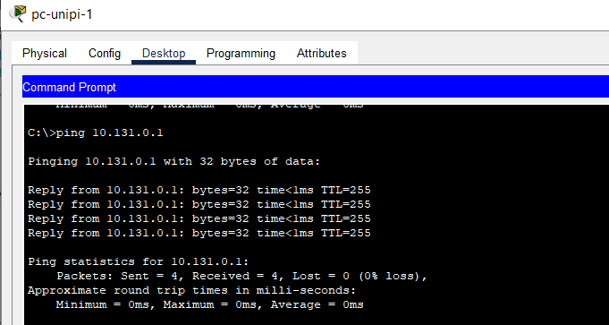{#fig:008 width=70%}

## Настройка VPN на основе GRE

Настроим VPN на основе протокола GRE. Для этого на маршрутизаторе с Донской зададим интерфейс и ip-адрес для туннеля, указав источником интерфейс f0/1.4(vlan в Интернет), а точкой назначения адрес 192.0.2.20(маршрутизатор Университета Пизы в сети Интернет). Также поднимем loopback-интерфейс, на котором зададим loopback-адрес машрутизатора и маршрут по умолчанию до Пизы, указав, что надо посылать на loopback-адрес, идя через туннельный адрес маршрутизатора в г. Пиза(рис. [-@fig:009]).

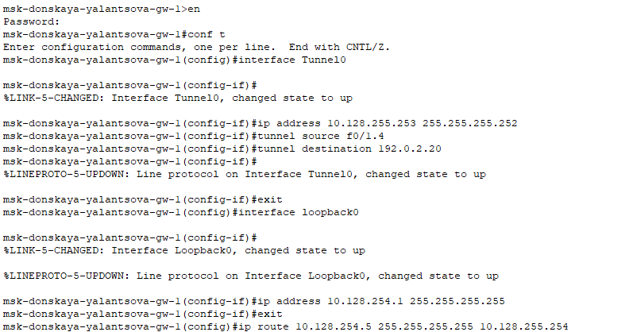{#fig:009 width=70%}

Теперь на маршрутизаторе в Пизе зададим интерфейс и ip-адрес для туннеля, указав источником интерфейс f0/1(свзяь с сетью Интернет), а точкой назначения адрес 198.51.100.2(внешний адрес маршрутизатора Донской). Также поднимем loopback-интерфейс, на котором зададим loopback-адрес машрутизатора и маршрут по умолчанию до Донской, указав, что надо посылать на loopback-адрес, идя через туннельный адрес маршрутизатора на Донской. Кроме того настроим протокол OSPF(рис. [-@fig:010]):

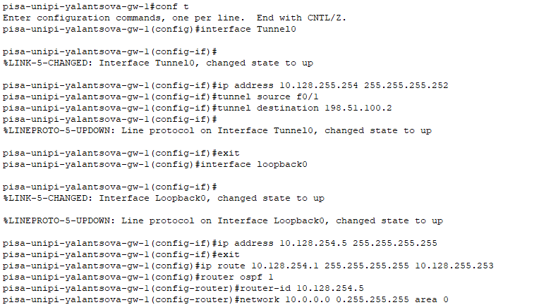{#fig:010 width=70%}

Проверим доступность узлов сети Университета г. Пиза, пропинговав Пк в Пизе с ноутбука администратора сети «Донская»(рис. [-@fig:011]):

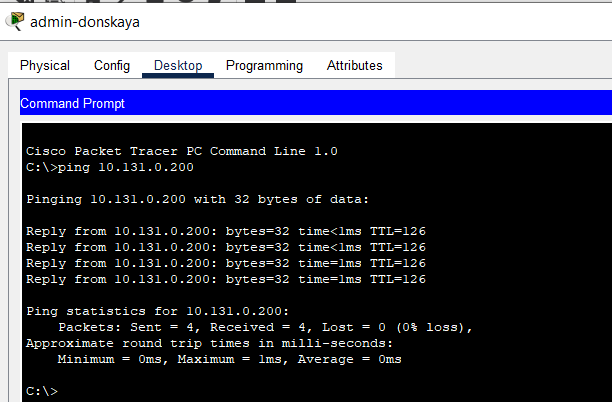{#fig:011 width=70%}

# Выводы

В результате выполнения лабораторной были приобретены практические навыки по настройке VPN-туннеля через незащищённое Интернет-соединение.

# Контрольные вопросы

1. Что такое VPN?

Виртуальная частная сеть (Virtual Private Network, VPN) — технология, обеспечивающая одно или несколько сетевых соединений поверх другой сети (например, Интернет).

2. В каких случаях следует использовать VPN?

- Обеспечение безопасности и конфиденциальности: VPN шифрует ваше интернет-соединение, что позволяет защитить ваши данные от несанкционированного доступа и прослушивания. Это особенно важно при использовании общественных Wi-Fi сетей, где ваша информация может быть уязвима.
- Обход географических ограничений: VPN позволяет обойти географические ограничения и получить доступ к контенту, который может быть недоступен в вашей стране. Например, вы можете получить доступ к стриминговым сервисам, социальным сетям или новостным сайтам, которые ограничены в вашем регионе.
- Анонимность и защита личной информации: VPN скрывает ваш реальный IP-адрес и заменяет его на IP-адрес сервера VPN. Это помогает сохранить вашу анонимность и защитить вашу личную информацию от отслеживания и сбора данных о вас.
- Работа из удаленного офиса: Если вы работаете из удаленного офиса или подключаетесь к корпоративной сети из дома, VPN обеспечивает безопасное соединение и защищает корпоративные данные от утечки.

3. Как с помощью VPN обойти NAT?

При подключении к VPN-серверу устройство получает новый виртуальный IP-адрес, который не связан с реальным IP-адресом. Это позволяет обойти ограничения NAT и получить доступ к ресурсам в Интернете, которые могут быть недоступны из-за NAT.
